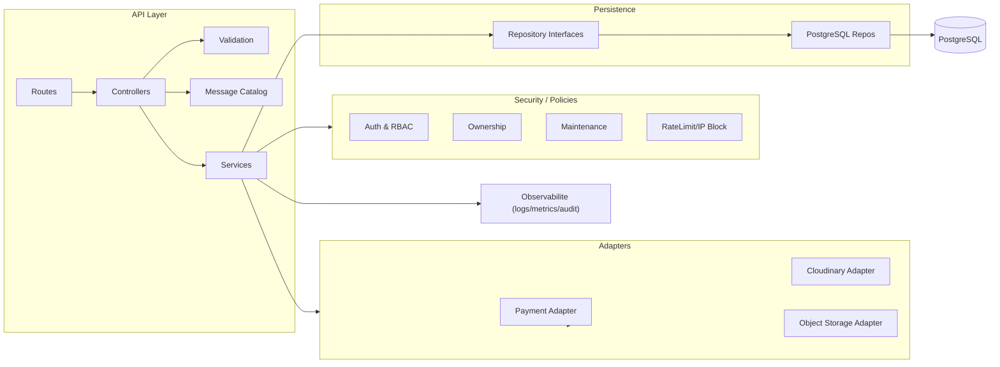

# Architecture logique — Composants backend

- Couche API : routes -> controllers -> validation -> messages d'erreur.
- Services metier : logique, orchestration et politiques (auth, RBAC, ownership, maintenance).
- Adapters : payment, storage, cloudinary, envoi events/notifications.
- Persistance : interfaces de repository -> impl PostgreSQL.
- Observabilite : audit, logs, metrics accessibles depuis services et adapters.

