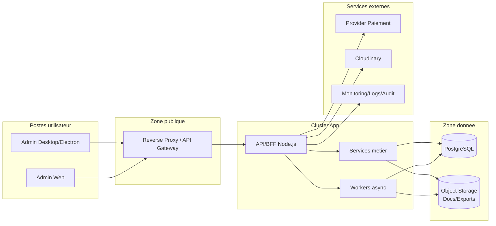

# Architecture physique — Deploiement

- Couches : utilisateurs -> reverse proxy/API GW (DMZ) -> cluster app -> data.
- Ressources : conteneurs Node (API/BFF + workers), PostgreSQL managé, object storage, observabilite externalisée.

