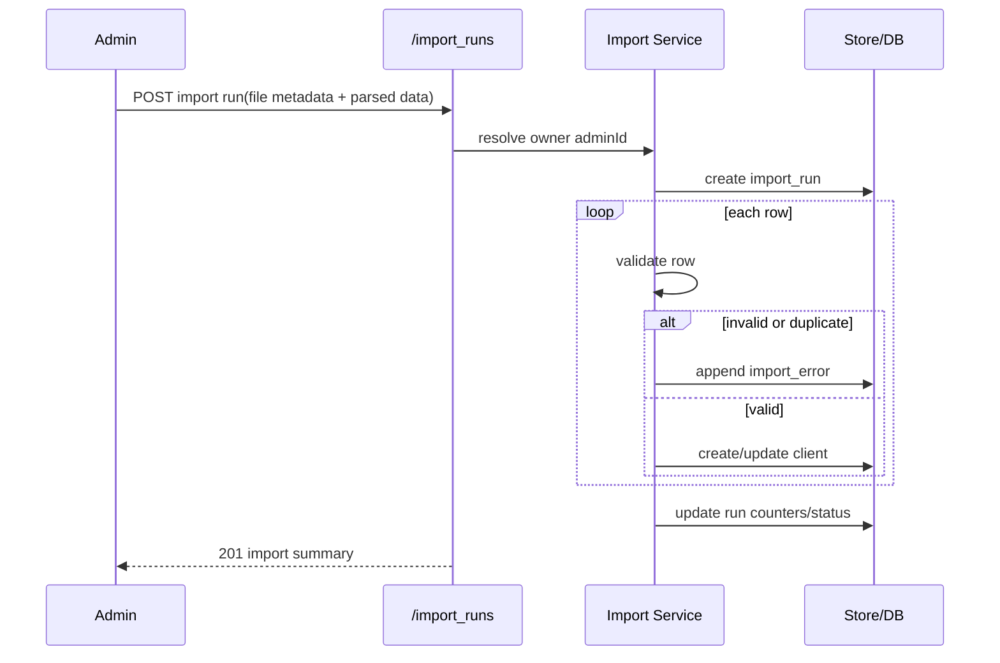

# Sequence — Import clients + erreurs

```mermaid
sequenceDiagram
  participant Admin as Admin
  participant API as /import_runs
  participant Svc as Import Service
  participant DB as Store/DB

  Admin->>API: POST import run(file metadata + parsed data)
  API->>Svc: resolve owner adminId
  Svc->>DB: create import_run
  loop each row
    Svc->>Svc: validate row
    alt invalid or duplicate
      Svc->>DB: append import_error
    else valid
      Svc->>DB: create/update client
    end
  end
  Svc->>DB: update run counters/status
  API-->>Admin: 201 import summary
```
