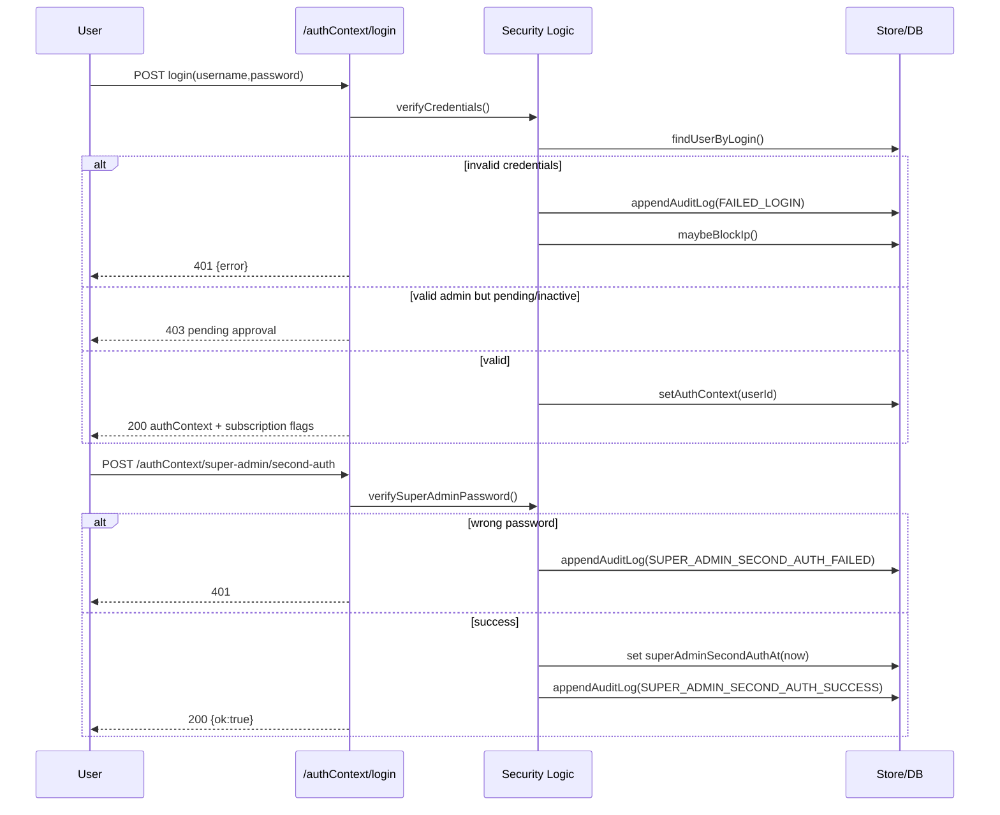

# Sequence — Login + second auth

```mermaid
sequenceDiagram
  participant User as User
  participant API as /authContext/login
  participant Sec as Security Logic
  participant Data as Store/DB

  User->>API: POST login(username,password)
  API->>Sec: verifyCredentials()
  Sec->>Data: findUserByLogin()
  alt invalid credentials
    Sec->>Data: appendAuditLog(FAILED_LOGIN)
    Sec->>Data: maybeBlockIp()
    API-->>User: 401 {error}
  else valid admin but pending/inactive
    API-->>User: 403 pending approval
  else valid
    Sec->>Data: setAuthContext(userId)
    API-->>User: 200 authContext + subscription flags
  end

  User->>API: POST /authContext/super-admin/second-auth
  API->>Sec: verifySuperAdminPassword()
  alt wrong password
    Sec->>Data: appendAuditLog(SUPER_ADMIN_SECOND_AUTH_FAILED)
    API-->>User: 401
  else success
    Sec->>Data: set superAdminSecondAuthAt(now)
    Sec->>Data: appendAuditLog(SUPER_ADMIN_SECOND_AUTH_SUCCESS)
    API-->>User: 200 {ok:true}
  end
```
