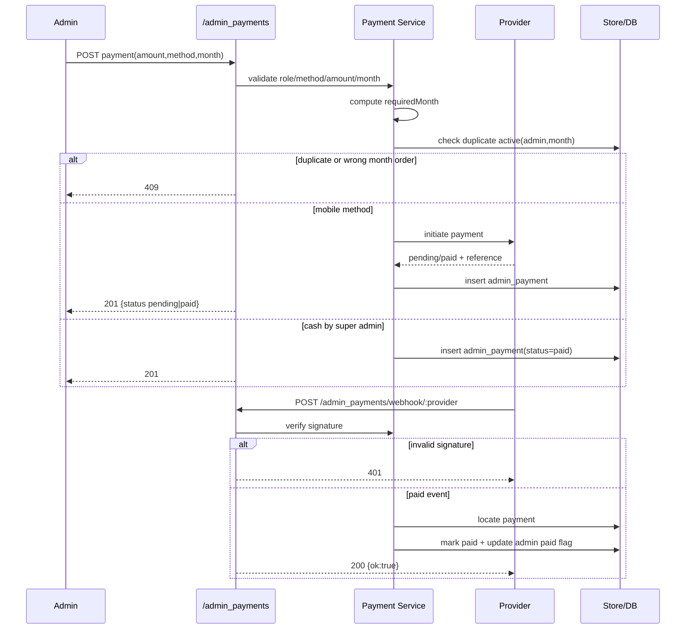

# Sequence — Creation paiement admin + webhook

```mermaid
sequenceDiagram
  participant Admin as Admin
  participant API as /admin_payments
  participant Svc as Payment Service
  participant PSP as Provider
  participant DB as Store/DB

  Admin->>API: POST payment(amount,method,month)
  API->>Svc: validate role/method/amount/month
  Svc->>Svc: compute requiredMonth
  Svc->>DB: check duplicate active(admin,month)
  alt duplicate or wrong month order
    API-->>Admin: 409
  else mobile method
    Svc->>PSP: initiate payment
    PSP-->>Svc: pending/paid + reference
    Svc->>DB: insert admin_payment
    API-->>Admin: 201 {status pending|paid}
  else cash by super admin
    Svc->>DB: insert admin_payment(status=paid)
    API-->>Admin: 201
  end

  PSP->>API: POST /admin_payments/webhook/:provider
  API->>Svc: verify signature
  alt invalid signature
    API-->>PSP: 401
  else paid event
    Svc->>DB: locate payment
    Svc->>DB: mark paid + update admin paid flag
    API-->>PSP: 200 {ok:true}
  end
```
