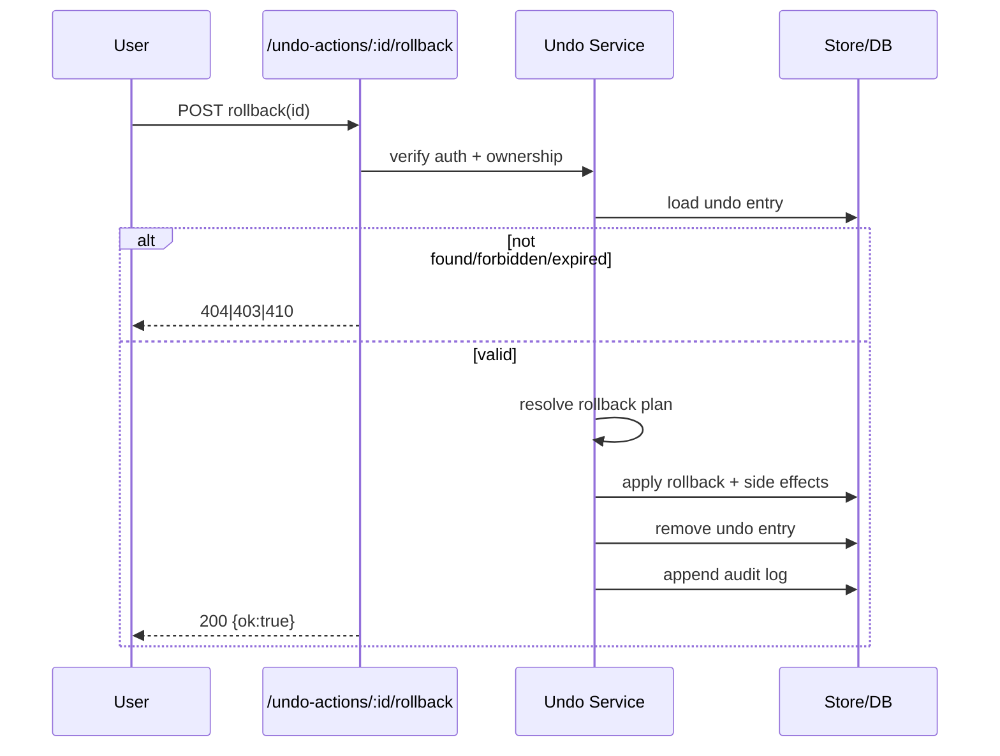

# Sequence — Undo rollback

```mermaid
sequenceDiagram
  participant U as User
  participant API as /undo-actions/:id/rollback
  participant Undo as Undo Service
  participant DB as Store/DB

  U->>API: POST rollback(id)
  API->>Undo: verify auth + ownership
  Undo->>DB: load undo entry
  alt not found/forbidden/expired
    API-->>U: 404|403|410
  else valid
    Undo->>Undo: resolve rollback plan
    Undo->>DB: apply rollback + side effects
    Undo->>DB: remove undo entry
    Undo->>DB: append audit log
    API-->>U: 200 {ok:true}
  end
```
