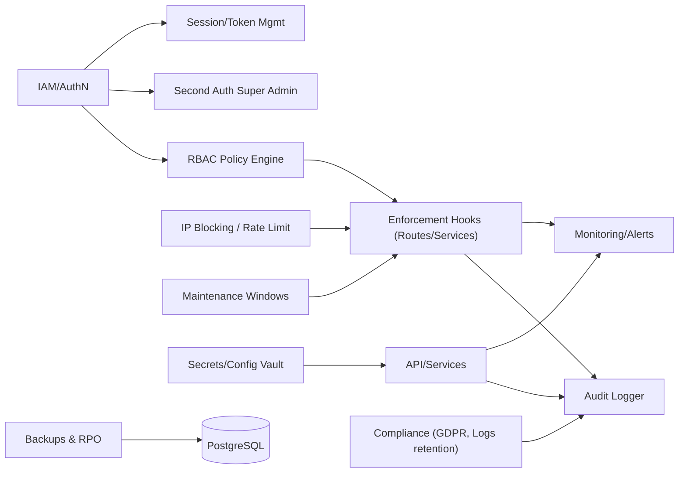

# Gouvernance et securite

- Gouvernance : IAM + RBAC + ownership + maintenance window.
- Protection : rate-limit/IP block au niveau gateway/controllers.
- Conformite : audits centralises, retention, sauvegardes.

