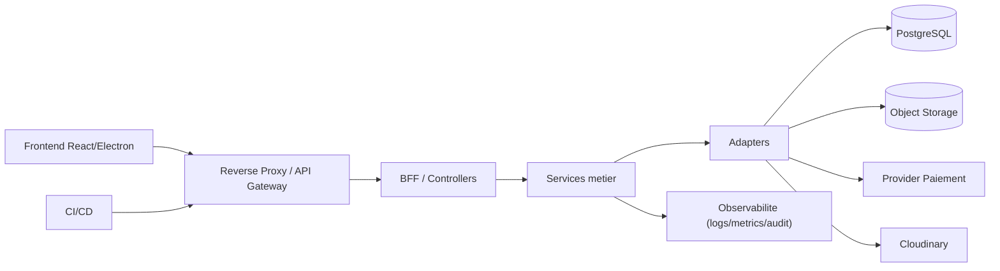

# Architecture globale (vue haute)

- Portee : interactions principales entre front, gateway, couche metier, adapteurs et dependances externes.
- Hypotheses : single API publique derriere un reverse-proxy, stockage principal PostgreSQL + object storage, observabilite centralisee.

