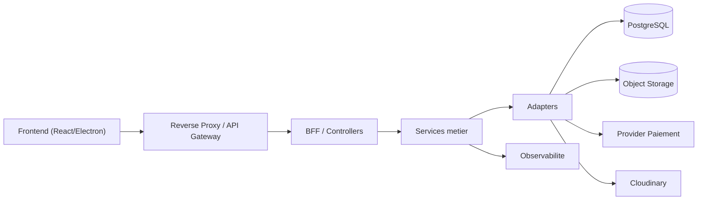

# Vue d'ensemble architecture (composants)

- Stratification : Gateway -> BFF/Controllers -> Services -> Adapters -> Data/Externes.
- Dependances externes : paiement, stockage fichiers, cloudinary, observabilite.

