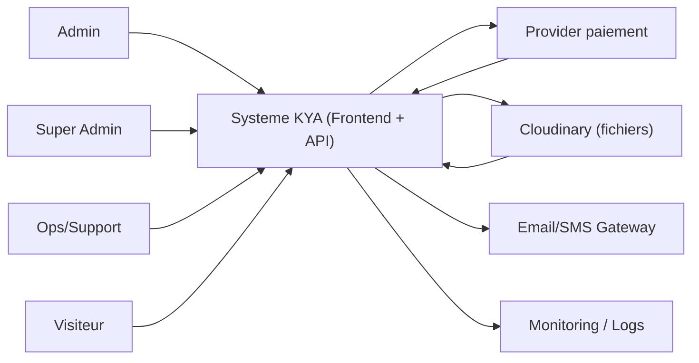

# Diagramme de contexte

```mermaid
flowchart LR
  Admin["Admin"]
  SA["Super Admin"]
  Ops["Ops/Support"]
  Visiteur["Visiteur"]
  PSP["Provider paiement"]
  Cloud["Cloudinary (fichiers)"]
  Mail["Email/SMS Gateway"]
  Monitor["Monitoring / Logs"]

  Admin --> KYA
  SA --> KYA
  Ops --> KYA
  Visiteur --> KYA

  KYA["Systeme KYA (Frontend + API)"] --> PSP
  KYA --> Cloud
  KYA --> Mail
  KYA --> Monitor
  PSP --> KYA
  Cloud --> KYA
```
