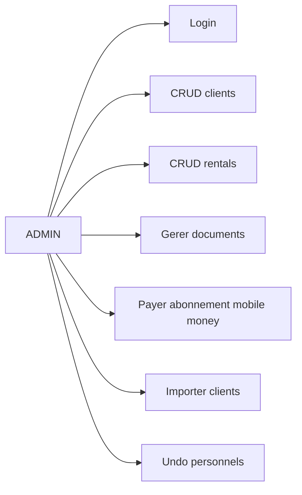

# Cas d'utilisation (Analyse) — ADMIN

```mermaid
flowchart LR
  AD["ADMIN"] --> A1["Login"]
  AD --> A2["CRUD clients"]
  AD --> A3["CRUD rentals"]
  AD --> A4["Gerer documents"]
  AD --> A5["Payer abonnement mobile money"]
  AD --> A6["Importer clients"]
  AD --> A7["Undo personnels"]
```
