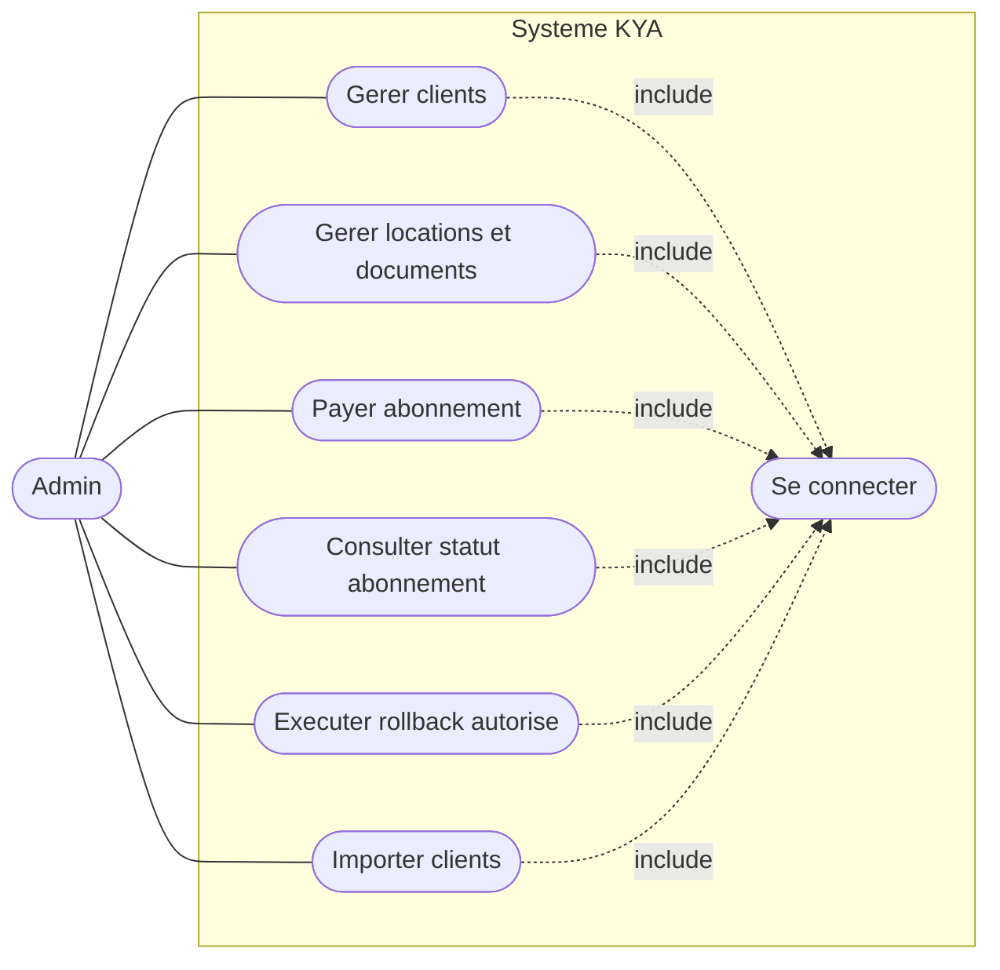

# Diagramme de cas d'utilisation — Admin (Analyse)

```mermaid
flowchart LR
  AD([Admin])
  subgraph SYS["Systeme KYA"]
    UC1([Gerer clients])
    UC2([Gerer locations et documents])
    UC3([Payer abonnement])
    UC4([Consulter statut abonnement])
    UC5([Executer rollback autorise])
    UC6([Importer clients])
    UC_LOGIN([Se connecter])
  end

  AD --- UC1
  AD --- UC2
  AD --- UC3
  AD --- UC4
  AD --- UC5
  AD --- UC6

  UC1 -. "include" .-> UC_LOGIN
  UC2 -. "include" .-> UC_LOGIN
  UC3 -. "include" .-> UC_LOGIN
  UC4 -. "include" .-> UC_LOGIN
  UC5 -. "include" .-> UC_LOGIN
  UC6 -. "include" .-> UC_LOGIN
```
