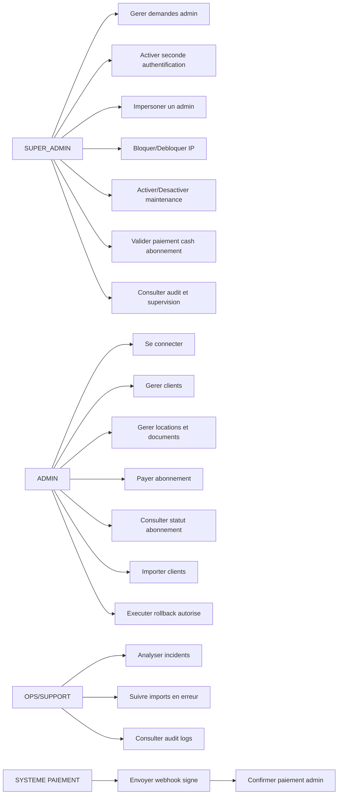

# Diagramme de cas d'utilisation — Vue globale (Analyse)

```mermaid
flowchart LR
  SA["SUPER_ADMIN"] --> UC1["Gerer demandes admin"]
  SA --> UC2["Activer seconde authentification"]
  SA --> UC3["Impersoner un admin"]
  SA --> UC4["Bloquer/Debloquer IP"]
  SA --> UC5["Activer/Desactiver maintenance"]
  SA --> UC6["Valider paiement cash abonnement"]
  SA --> UC7["Consulter audit et supervision"]

  AD["ADMIN"] --> UC8["Se connecter"]
  AD --> UC9["Gerer clients"]
  AD --> UC10["Gerer locations et documents"]
  AD --> UC11["Payer abonnement"]
  AD --> UC12["Consulter statut abonnement"]
  AD --> UC13["Importer clients"]
  AD --> UC14["Executer rollback autorise"]

  OPS["OPS/SUPPORT"] --> UC15["Analyser incidents"]
  OPS --> UC16["Suivre imports en erreur"]
  OPS --> UC17["Consulter audit logs"]

  PSP["SYSTEME PAIEMENT"] --> UC18["Envoyer webhook signe"]
  UC18 --> UC19["Confirmer paiement admin"]
```
