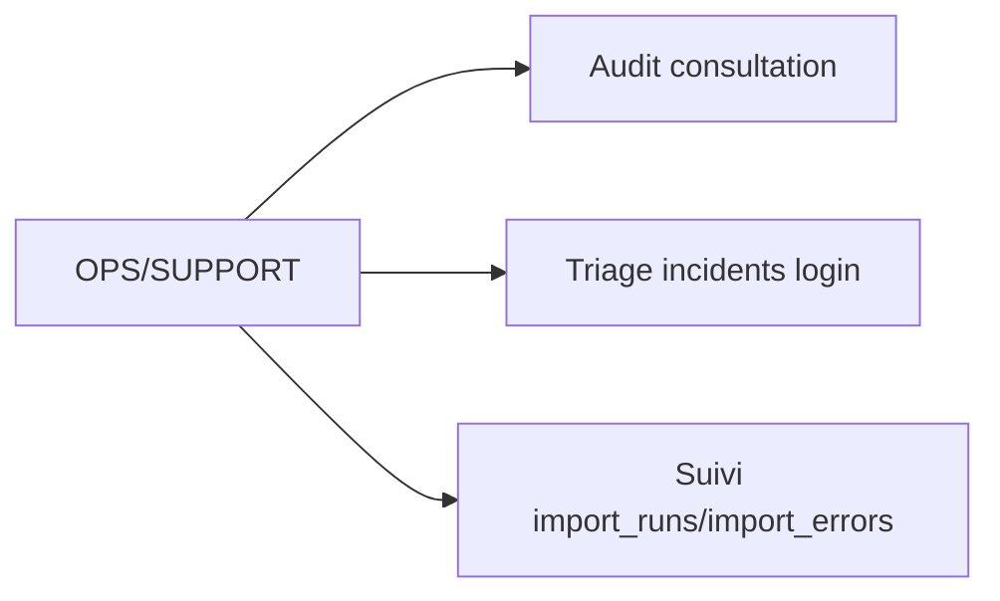

# Cas d'utilisation (Analyse) — OPS/SUPPORT

```mermaid
flowchart LR
  OPS["OPS/SUPPORT"] --> O1["Audit consultation"]
  OPS --> O2["Triage incidents login"]
  OPS --> O3["Suivi import_runs/import_errors"]
```
