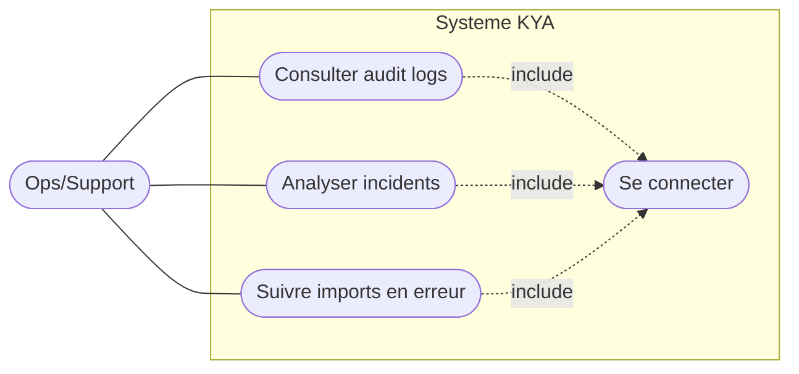

# Diagramme de cas d'utilisation — Ops/Support (Analyse)

```mermaid
flowchart LR
  OPS([Ops/Support])
  subgraph SYS["Systeme KYA"]
    O1([Consulter audit logs])
    O2([Analyser incidents])
    O3([Suivre imports en erreur])
    O_LOGIN([Se connecter])
  end

  OPS --- O1
  OPS --- O2
  OPS --- O3

  O1 -. "include" .-> O_LOGIN
  O2 -. "include" .-> O_LOGIN
  O3 -. "include" .-> O_LOGIN
```
