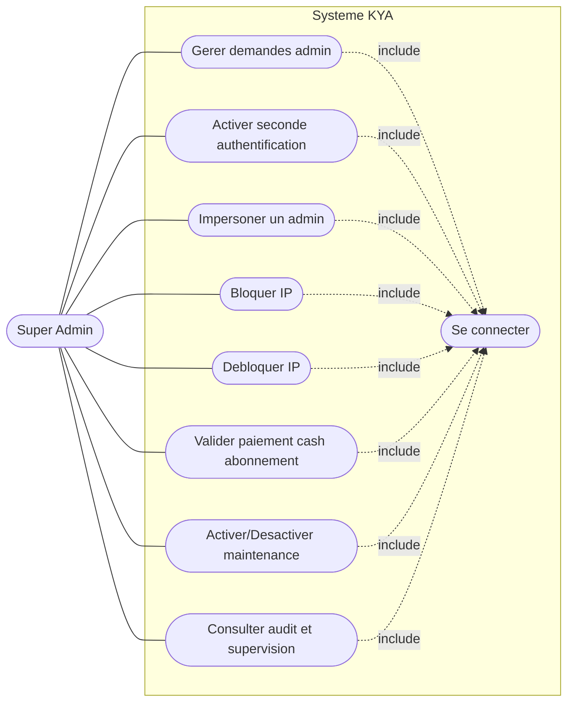

# Diagramme de cas d'utilisation — Super Admin (Analyse)

```mermaid
flowchart LR
  SA([Super Admin])
  subgraph SYS["Systeme KYA"]
    S1([Gerer demandes admin])
    S2([Activer seconde authentification])
    S3([Impersoner un admin])
    S4([Bloquer IP])
    S5([Debloquer IP])
    S6([Valider paiement cash abonnement])
    S7([Activer/Desactiver maintenance])
    S8([Consulter audit et supervision])
    S_LOGIN([Se connecter])
  end

  SA --- S1
  SA --- S2
  SA --- S3
  SA --- S4
  SA --- S5
  SA --- S6
  SA --- S7
  SA --- S8

  S1 -. "include" .-> S_LOGIN
  S2 -. "include" .-> S_LOGIN
  S3 -. "include" .-> S_LOGIN
  S4 -. "include" .-> S_LOGIN
  S5 -. "include" .-> S_LOGIN
  S6 -. "include" .-> S_LOGIN
  S7 -. "include" .-> S_LOGIN
  S8 -. "include" .-> S_LOGIN
```
