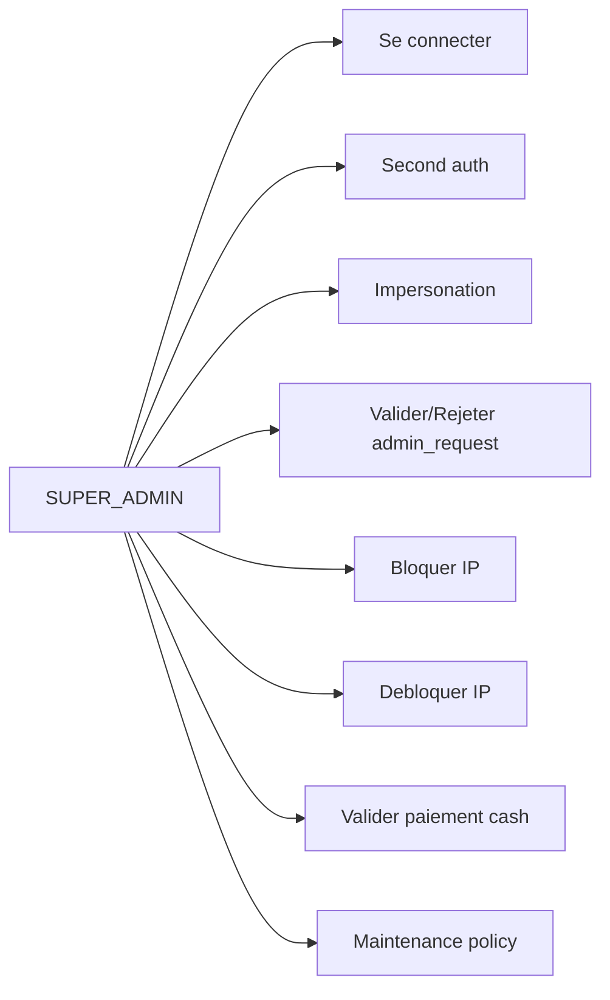

# Cas d'utilisation (Analyse) — SUPER_ADMIN

```mermaid
flowchart LR
  SA["SUPER_ADMIN"] --> S1["Se connecter"]
  SA --> S2["Second auth"]
  SA --> S3["Impersonation"]
  SA --> S4["Valider/Rejeter admin_request"]
  SA --> S5["Bloquer IP"]
  SA --> S6["Debloquer IP"]
  SA --> S7["Valider paiement cash"]
  SA --> S8["Maintenance policy"]
```
