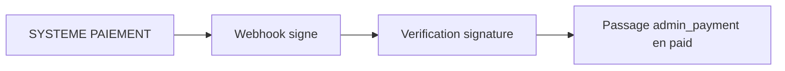

# Cas d'utilisation (Analyse) — SYSTEME PAIEMENT

```mermaid
flowchart LR
  PSP["SYSTEME PAIEMENT"] --> P1["Webhook signe"]
  P1 --> P2["Verification signature"]
  P2 --> P3["Passage admin_payment en paid"]
```
