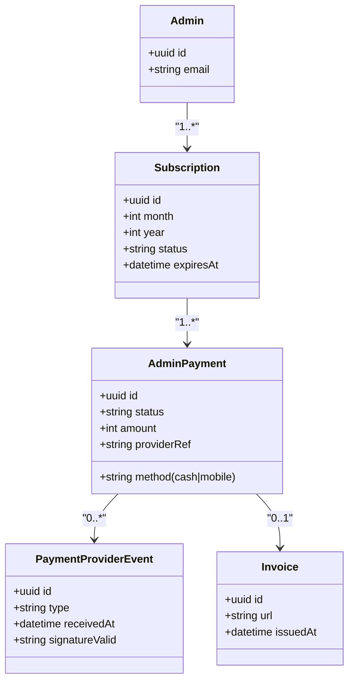

# Diagramme de classes — Abonnement administrateur et reglements

```mermaid
classDiagram
  class Admin {
    +uuid id
    +string email
  }
  class Subscription {
    +uuid id
    +int month
    +int year
    +string status
    +datetime expiresAt
  }
  class AdminPayment {
    +uuid id
    +string method (cash|mobile)
    +string status
    +int amount
    +string providerRef
  }
  class PaymentProviderEvent {
    +uuid id
    +string type
    +datetime receivedAt
    +string signatureValid
  }
  class Invoice {
    +uuid id
    +string url
    +datetime issuedAt
  }

  Admin --> Subscription : "1..*"
  Subscription --> AdminPayment : "1..*"
  AdminPayment --> PaymentProviderEvent : "0..*"
  AdminPayment --> Invoice : "0..1"
```
