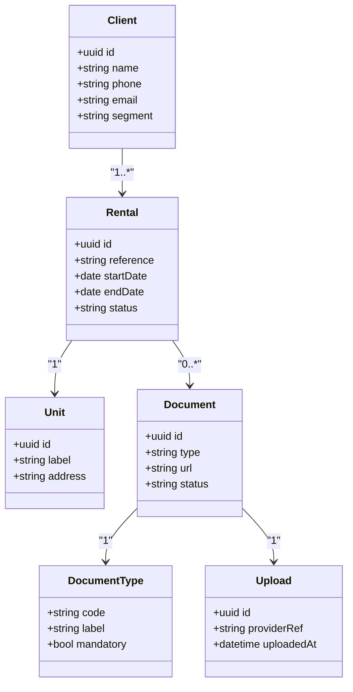

# Diagramme de classes — Gestion locative clients et documents

```mermaid
classDiagram
  class Client {
    +uuid id
    +string name
    +string phone
    +string email
    +string segment
  }
  class Rental {
    +uuid id
    +string reference
    +date startDate
    +date endDate
    +string status
  }
  class Unit {
    +uuid id
    +string label
    +string address
  }
  class Document {
    +uuid id
    +string type
    +string url
    +string status
  }
  class DocumentType {
    +string code
    +string label
    +bool mandatory
  }
  class Upload {
    +uuid id
    +string providerRef
    +datetime uploadedAt
  }

  Client --> Rental : "1..*"
  Rental --> Unit : "1"
  Rental --> Document : "0..*"
  Document --> DocumentType : "1"
  Document --> Upload : "1"
```
