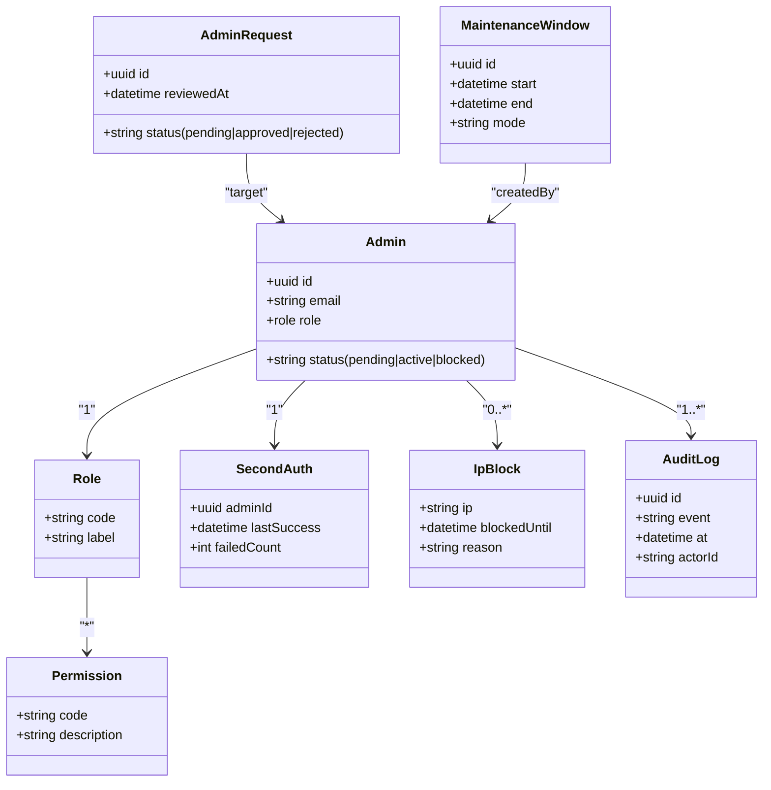

# Diagramme de classes — Gouvernance des acces et comptes administrateur

```mermaid
classDiagram
  class Admin {
    +uuid id
    +string email
    +string status (pending|active|blocked)
    +role role
  }
  class AdminRequest {
    +uuid id
    +string status (pending|approved|rejected)
    +datetime reviewedAt
  }
  class Role {
    +string code
    +string label
  }
  class Permission {
    +string code
    +string description
  }
  class SecondAuth {
    +uuid adminId
    +datetime lastSuccess
    +int failedCount
  }
  class IpBlock {
    +string ip
    +datetime blockedUntil
    +string reason
  }
  class MaintenanceWindow {
    +uuid id
    +datetime start
    +datetime end
    +string mode
  }
  class AuditLog {
    +uuid id
    +string event
    +datetime at
    +string actorId
  }

  AdminRequest --> Admin : "target"
  Admin --> Role : "1"
  Role --> Permission : "*"
  Admin --> SecondAuth : "1"
  Admin --> IpBlock : "0..*"
  MaintenanceWindow --> Admin : "createdBy"
  Admin --> AuditLog : "1..*"
```
