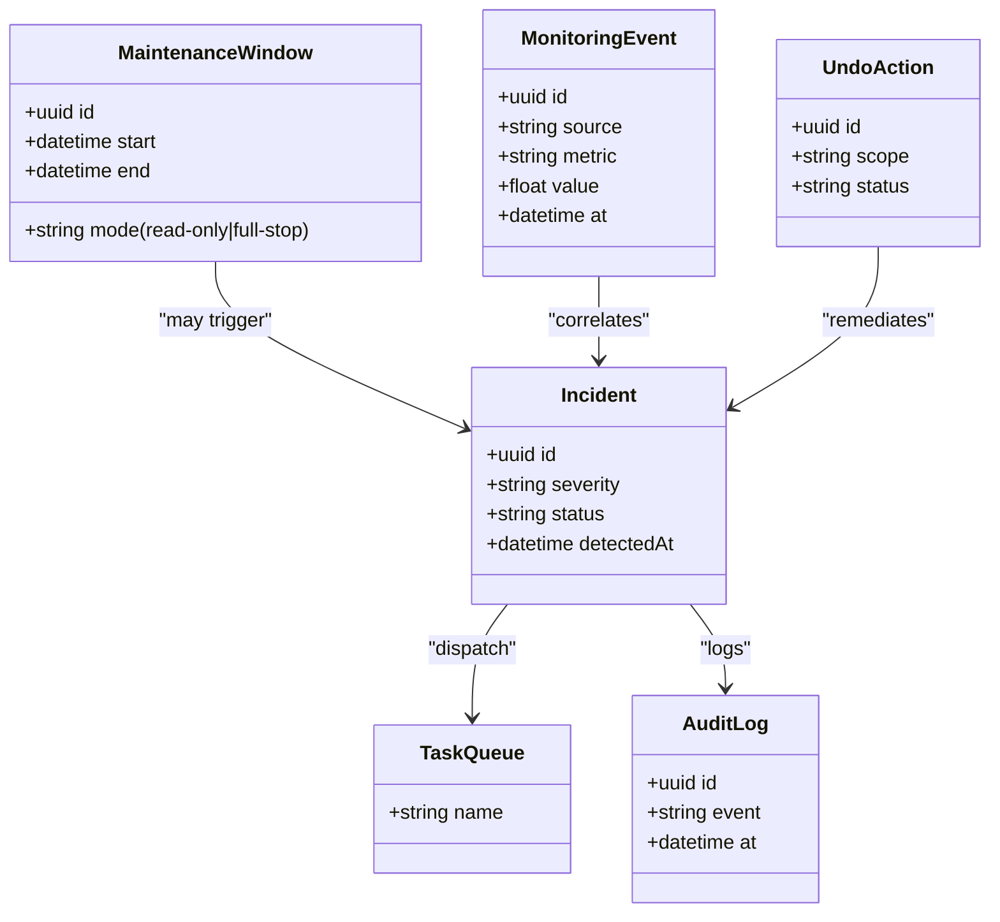

# Diagramme de classes — Supervision maintenance et controle global

```mermaid
classDiagram
  class MaintenanceWindow {
    +uuid id
    +datetime start
    +datetime end
    +string mode (read-only|full-stop)
  }
  class Incident {
    +uuid id
    +string severity
    +string status
    +datetime detectedAt
  }
  class MonitoringEvent {
    +uuid id
    +string source
    +string metric
    +float value
    +datetime at
  }
  class AuditLog {
    +uuid id
    +string event
    +datetime at
  }
  class UndoAction {
    +uuid id
    +string scope
    +string status
  }
  class TaskQueue {
    +string name
  }

  MaintenanceWindow --> Incident : "may trigger"
  MonitoringEvent --> Incident : "correlates"
  Incident --> TaskQueue : "dispatch"
  UndoAction --> Incident : "remediates"
  Incident --> AuditLog : "logs"
```
