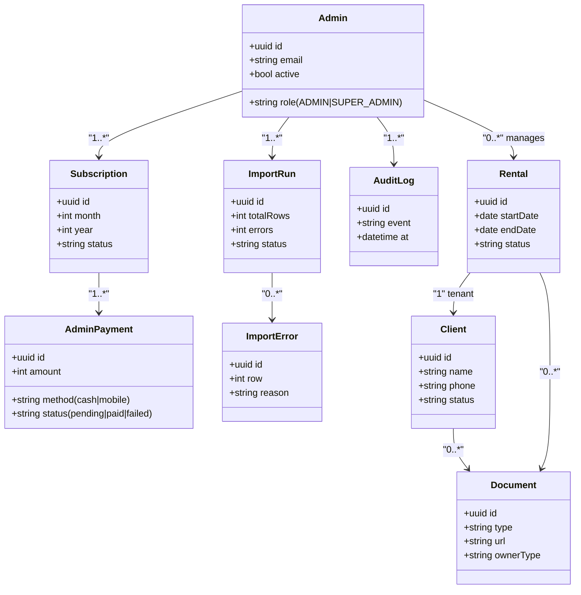

# Diagramme de classes — Vue globale du domaine

```mermaid
classDiagram
  class Admin {
    +uuid id
    +string email
    +string role (ADMIN|SUPER_ADMIN)
    +bool active
  }
  class Client {
    +uuid id
    +string name
    +string phone
    +string status
  }
  class Rental {
    +uuid id
    +date startDate
    +date endDate
    +string status
  }
  class Document {
    +uuid id
    +string type
    +string url
    +string ownerType
  }
  class Subscription {
    +uuid id
    +int month
    +int year
    +string status
  }
  class AdminPayment {
    +uuid id
    +string method (cash|mobile)
    +string status (pending|paid|failed)
    +int amount
  }
  class ImportRun {
    +uuid id
    +int totalRows
    +int errors
    +string status
  }
  class ImportError {
    +uuid id
    +int row
    +string reason
  }
  class AuditLog {
    +uuid id
    +string event
    +datetime at
  }

  Admin --> Subscription : "1..*"
  Subscription --> AdminPayment : "1..*"
  Admin --> ImportRun : "1..*"
  ImportRun --> ImportError : "0..*"
  Admin --> AuditLog : "1..*"
  Admin --> Rental : "0..*" manages
  Rental --> Client : "1" tenant
  Client --> Document : "0..*"
  Rental --> Document : "0..*"
```
