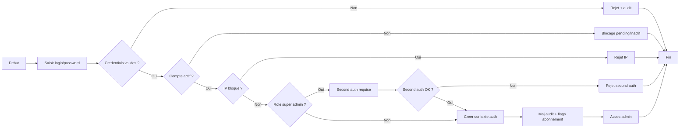

# Activite — Authentifier et acceder en tant qu'admin

```mermaid
flowchart LR
  A[Debut] --> B[Saisir login/password]
  B --> C{Credentials valides ?}
  C -->|Non| X1[Rejet + audit]
  C -->|Oui| D{Compte actif ?}
  D -->|Non| X2[Blocage pending/inactif]
  D -->|Oui| E{IP bloque ?}
  E -->|Oui| X3[Rejet IP]
  E -->|Non| F{Role super admin ?}
  F -->|Oui| G[Second auth requise]
  F -->|Non| I[Creer contexte auth]
  G --> H{Second auth OK ?}
  H -->|Non| X4[Rejet second auth]
  H -->|Oui| I
  I --> J[Maj audit + flags abonnement]
  J --> K[Acces admin]
  X1 --> L[Fin]
  X2 --> L
  X3 --> L
  X4 --> L
  K --> L
```
