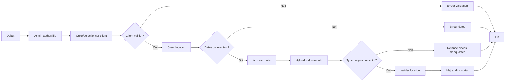

# Activite — Gestion locative (clients, locations, documents)

```mermaid
flowchart LR
  A[Debut] --> B[Admin authentifie]
  B --> C[Creer/selectionner client]
  C --> D{Client valide ?}
  D -->|Non| X1[Erreur validation]
  D -->|Oui| E[Creer location]
  E --> F{Dates coherentes ?}
  F -->|Non| X2[Erreur dates]
  F -->|Oui| G[Associer unite]
  G --> H[Uploader documents]
  H --> I{Types requis presents ?}
  I -->|Non| X3[Relance pieces manquantes]
  I -->|Oui| J[Valider location]
  J --> K[Maj audit + statut]
  X1 --> L[Fin]
  X2 --> L
  X3 --> L
  K --> L
```
