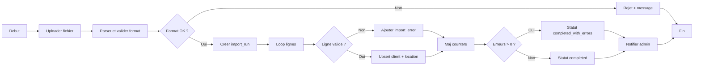

# Activite — Import de donnees clients

```mermaid
flowchart LR
  A[Debut] --> B[Uploader fichier]
  B --> C[Parser et valider format]
  C --> D{Format OK ?}
  D -->|Non| X1[Rejet + message]
  D -->|Oui| E[Creer import_run]
  E --> F[Loop lignes]
  F --> G{Ligne valide ?}
  G -->|Non| H[Ajouter import_error]
  G -->|Oui| I[Upsert client + location]
  H --> J[Maj counters]
  I --> J
  J --> K{Erreurs > 0 ?}
  K -->|Oui| L[Statut completed_with_errors]
  K -->|Non| M[Statut completed]
  L --> N[Notifier admin]
  M --> N
  X1 --> O[Fin]
  N --> O
```
