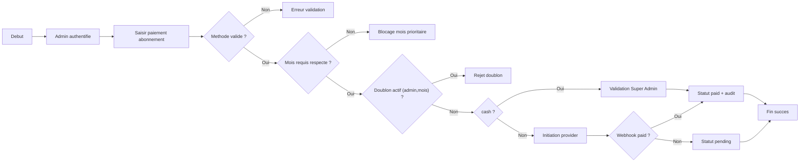

# Diagramme d'activité métier — Paiement abonnement admin

```mermaid
flowchart LR
  A["Debut"] --> B["Admin authentifie"]
  B --> C["Saisir paiement abonnement"]
  C --> D{"Methode valide ?"}
  D -->|Non| X1["Erreur validation"]
  D -->|Oui| E{"Mois requis respecte ?"}
  E -->|Non| X2["Blocage mois prioritaire"]
  E -->|Oui| F{"Doublon actif (admin,mois) ?"}
  F -->|Oui| X3["Rejet doublon"]
  F -->|Non| G{"cash ?"}
  G -->|Oui| H["Validation Super Admin"]
  G -->|Non| I["Initiation provider"]
  I --> J{"Webhook paid ?"}
  J -->|Oui| K["Statut paid + audit"]
  J -->|Non| L["Statut pending"]
  H --> K
  K --> M["Fin succes"]
  L --> M
```
