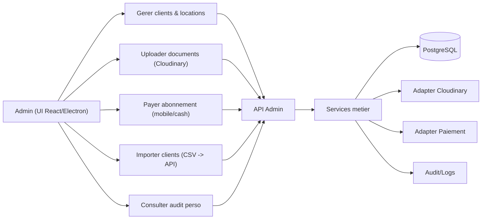

# Cas d'utilisation (Conception) — Admin

```mermaid
flowchart LR
  Admin["Admin (UI React/Electron)"] --> UC1["Gerer clients & locations"]
  Admin --> UC2["Uploader documents (Cloudinary)"]
  Admin --> UC3["Payer abonnement (mobile/cash)"]
  Admin --> UC4["Importer clients (CSV -> API)"]
  Admin --> UC5["Consulter audit perso"]

  UC1 --> API["API Admin"]
  UC2 --> API
  UC3 --> API
  UC4 --> API
  UC5 --> API

  API --> SVC["Services metier"]
  SVC --> DB[(PostgreSQL)]
  SVC --> CLD["Adapter Cloudinary"]
  SVC --> PSP["Adapter Paiement"]
  SVC --> AUD["Audit/Logs"]
```
