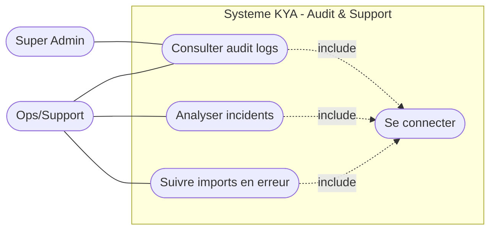

# Cas d'utilisation — Domaine Audit & Support (Conception)

```mermaid
flowchart LR
  OPS([Ops/Support])
  SA([Super Admin])
  subgraph SYS["Systeme KYA - Audit & Support"]
    OP1([Consulter audit logs])
    OP2([Analyser incidents])
    OP3([Suivre imports en erreur])
    OP_LOGIN([Se connecter])
  end

  OPS --- OP1
  OPS --- OP2
  OPS --- OP3
  SA --- OP1

  OP1 -. "include" .-> OP_LOGIN
  OP2 -. "include" .-> OP_LOGIN
  OP3 -. "include" .-> OP_LOGIN
```
