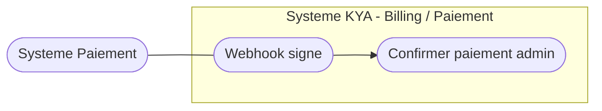

# Cas d'utilisation — Domaine Billing / Paiement (Conception)

```mermaid
flowchart LR
  PSP([Systeme Paiement])
  subgraph SYS["Systeme KYA - Billing / Paiement"]
    BILL1([Webhook signe])
    BILL2([Confirmer paiement admin])
  end

  PSP --- BILL1
  BILL1 --> BILL2
```
