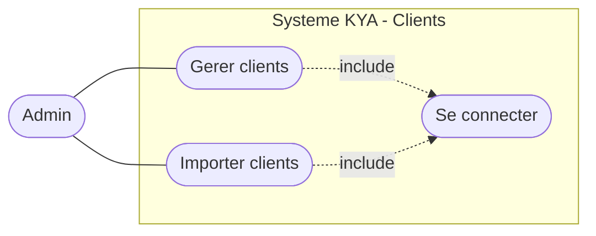

# Cas d'utilisation — Domaine Clients (Conception)

```mermaid
flowchart LR
  AD([Admin])
  subgraph SYS["Systeme KYA - Clients"]
    CL1([Gerer clients])
    CL2([Importer clients])
    CL_LOGIN([Se connecter])
  end

  AD --- CL1
  AD --- CL2

  CL1 -. "include" .-> CL_LOGIN
  CL2 -. "include" .-> CL_LOGIN
```
