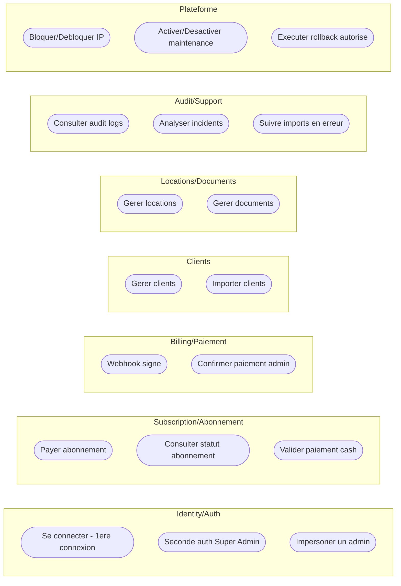

# Cas d'utilisation (Conception) — Par domaine

- Identity / Auth : `diagramme-cas-utilisation-conception-identity-auth.md`
- Subscription / Abonnement : `diagramme-cas-utilisation-conception-subscription-abonnement.md`
- Billing / Paiement : `diagramme-cas-utilisation-conception-billing-paiement.md`
- Clients : `diagramme-cas-utilisation-conception-clients.md`
- Locations & Documents : `diagramme-cas-utilisation-conception-locations-documents.md`
- Audit & Support : `diagramme-cas-utilisation-conception-audit-support.md`
- Plateforme : `diagramme-cas-utilisation-conception-plateforme.md`

Une vue combinée reste disponible ici pour référence rapide :

