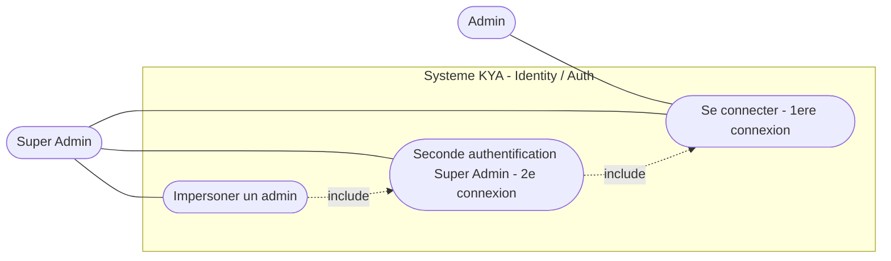

# Cas d'utilisation — Domaine Identity / Auth (Conception)

```mermaid
flowchart LR
  AD([Admin])
  SA([Super Admin])
  subgraph SYS["Systeme KYA - Identity / Auth"]
    ID1([Se connecter - 1ere connexion])
    ID2([Seconde authentification Super Admin - 2e connexion])
    ID3([Impersoner un admin])
  end

  AD --- ID1
  SA --- ID1
  SA --- ID2
  SA --- ID3

  ID2 -. "include" .-> ID1
  ID3 -. "include" .-> ID2
```
