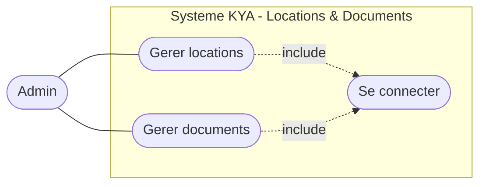

# Cas d'utilisation — Domaine Locations & Documents (Conception)

```mermaid
flowchart LR
  AD([Admin])
  subgraph SYS["Systeme KYA - Locations & Documents"]
    LO1([Gerer locations])
    DOC1([Gerer documents])
    LD_LOGIN([Se connecter])
  end

  AD --- LO1
  AD --- DOC1

  LO1 -. "include" .-> LD_LOGIN
  DOC1 -. "include" .-> LD_LOGIN
```
