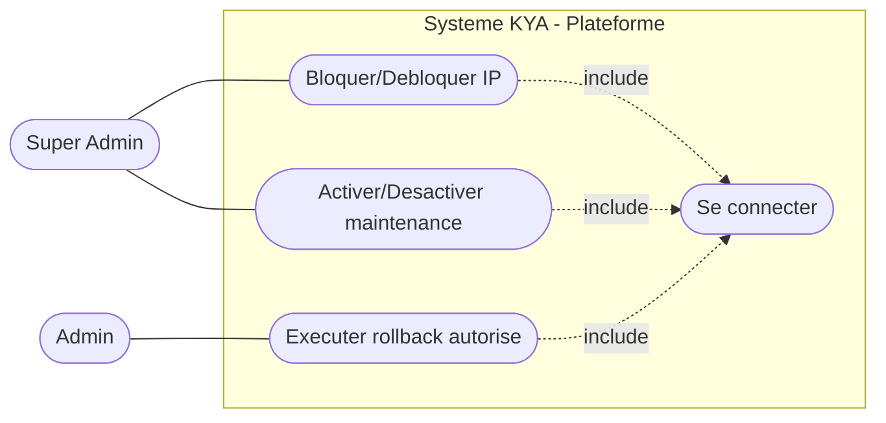

# Cas d'utilisation — Domaine Plateforme (Conception)

```mermaid
flowchart LR
  SA([Super Admin])
  AD([Admin])
  subgraph SYS["Systeme KYA - Plateforme"]
    PF1([Bloquer/Debloquer IP])
    PF2([Activer/Desactiver maintenance])
    PF3([Executer rollback autorise])
    PF_LOGIN([Se connecter])
  end

  SA --- PF1
  SA --- PF2
  AD --- PF3

  PF1 -. "include" .-> PF_LOGIN
  PF2 -. "include" .-> PF_LOGIN
  PF3 -. "include" .-> PF_LOGIN
```
