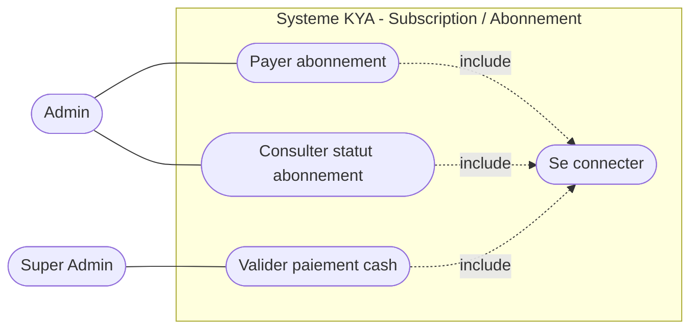

# Cas d'utilisation — Domaine Subscription / Abonnement (Conception)

```mermaid
flowchart LR
  AD([Admin])
  SA([Super Admin])
  subgraph SYS["Systeme KYA - Subscription / Abonnement"]
    SUB1([Payer abonnement])
    SUB2([Consulter statut abonnement])
    SUB3([Valider paiement cash])
    SUB_LOGIN([Se connecter])
  end

  AD --- SUB1
  AD --- SUB2
  SA --- SUB3

  SUB1 -. "include" .-> SUB_LOGIN
  SUB2 -. "include" .-> SUB_LOGIN
  SUB3 -. "include" .-> SUB_LOGIN
```
