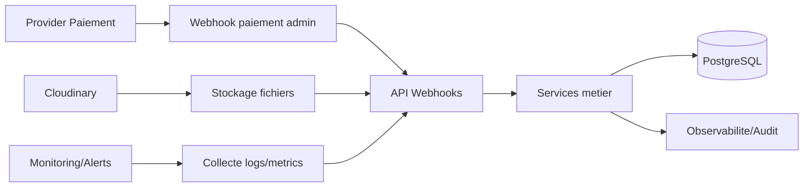

# Cas d'utilisation (Conception) — Externes

```mermaid
flowchart LR
  PSP["Provider Paiement"] --> UC1["Webhook paiement admin"]
  CLD["Cloudinary"] --> UC2["Stockage fichiers"]
  MON["Monitoring/Alerts"] --> UC3["Collecte logs/metrics"]

  UC1 --> API["API Webhooks"]
  UC2 --> API
  UC3 --> API

  API --> SVC["Services metier"]
  SVC --> DB[(PostgreSQL)]
  SVC --> OBS["Observabilite/Audit"]
```
