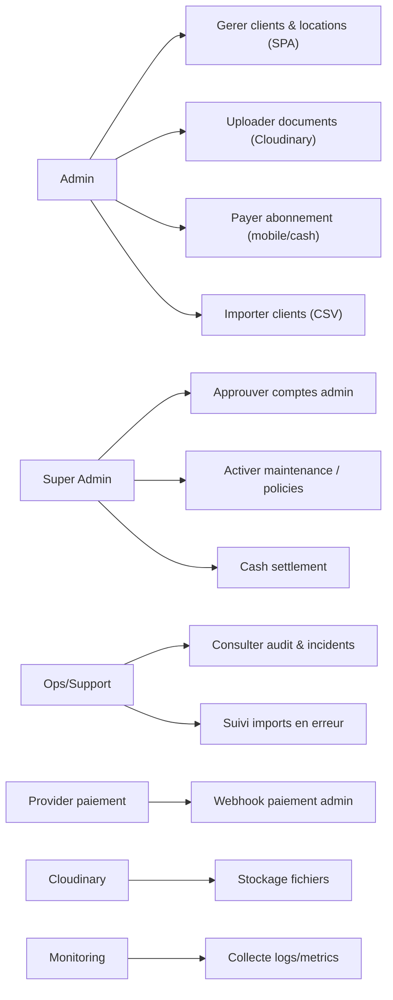

# Diagramme de cas d'utilisation — Conception

```mermaid
flowchart LR
  Admin["Admin"] --> UC1["Gerer clients & locations (SPA)"]
  Admin --> UC2["Uploader documents (Cloudinary)"]
  Admin --> UC3["Payer abonnement (mobile/cash)"]
  Admin --> UC4["Importer clients (CSV)"]

  SuperAdmin["Super Admin"] --> UC5["Approuver comptes admin"]
  SuperAdmin --> UC6["Activer maintenance / policies"]
  SuperAdmin --> UC7["Cash settlement"]

  Ops["Ops/Support"] --> UC8["Consulter audit & incidents"]
  Ops --> UC9["Suivi imports en erreur"]

  PSP["Provider paiement"] --> UC10["Webhook paiement admin"]
  Cloud["Cloudinary"] --> UC11["Stockage fichiers"]
  Monitor["Monitoring"] --> UC12["Collecte logs/metrics"]
```
