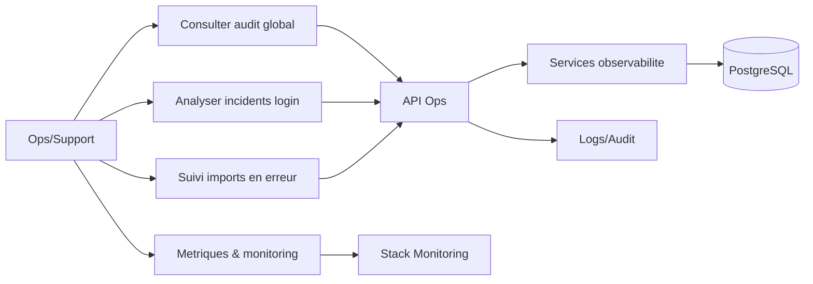

# Cas d'utilisation (Conception) — Ops / Support

```mermaid
flowchart LR
  OPS["Ops/Support"] --> UC1["Consulter audit global"]
  OPS --> UC2["Analyser incidents login"]
  OPS --> UC3["Suivi imports en erreur"]
  OPS --> UC4["Metriques & monitoring"]

  UC1 --> API["API Ops"]
  UC2 --> API
  UC3 --> API
  UC4 --> MON["Stack Monitoring"]

  API --> SVC["Services observabilite"]
  SVC --> DB[(PostgreSQL)]
  API --> LOG["Logs/Audit"]
```
