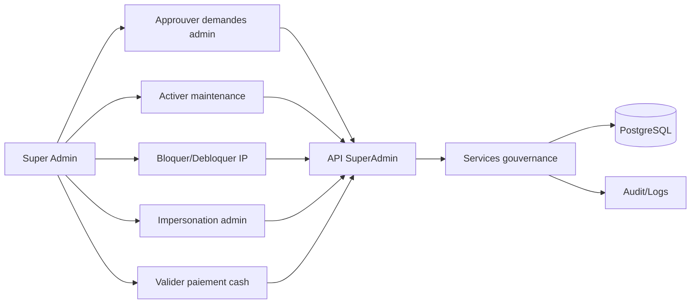

# Cas d'utilisation (Conception) — Super Admin

```mermaid
flowchart LR
  SA["Super Admin"] --> UC1["Approuver demandes admin"]
  SA --> UC2["Activer maintenance"]
  SA --> UC3["Bloquer/Debloquer IP"]
  SA --> UC4["Impersonation admin"]
  SA --> UC5["Valider paiement cash"]

  UC1 --> API["API SuperAdmin"]
  UC2 --> API
  UC3 --> API
  UC4 --> API
  UC5 --> API

  API --> SVC["Services gouvernance"]
  SVC --> DB[(PostgreSQL)]
  SVC --> AUD["Audit/Logs"]
```
