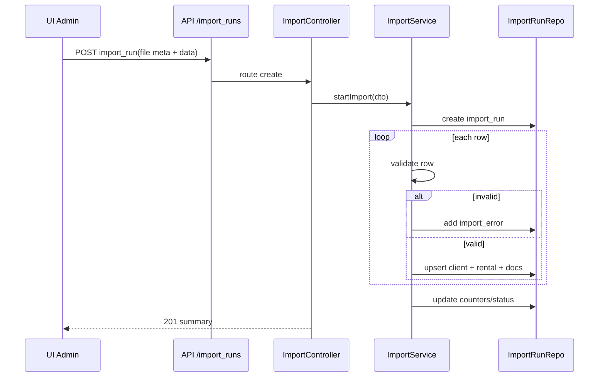

# Sequence (Conception) — Import clients

```mermaid
sequenceDiagram
  participant UI as UI Admin
  participant API as API /import_runs
  participant CTRL as ImportController
  participant SVC as ImportService
  participant DB as ImportRunRepo

  UI->>API: POST import_run(file meta + data)
  API->>CTRL: route create
  CTRL->>SVC: startImport(dto)
  SVC->>DB: create import_run
  loop each row
    SVC->>SVC: validate row
    alt invalid
      SVC->>DB: add import_error
    else valid
      SVC->>DB: upsert client + rental + docs
    end
  end
  SVC->>DB: update counters/status
  CTRL-->>UI: 201 summary
```
