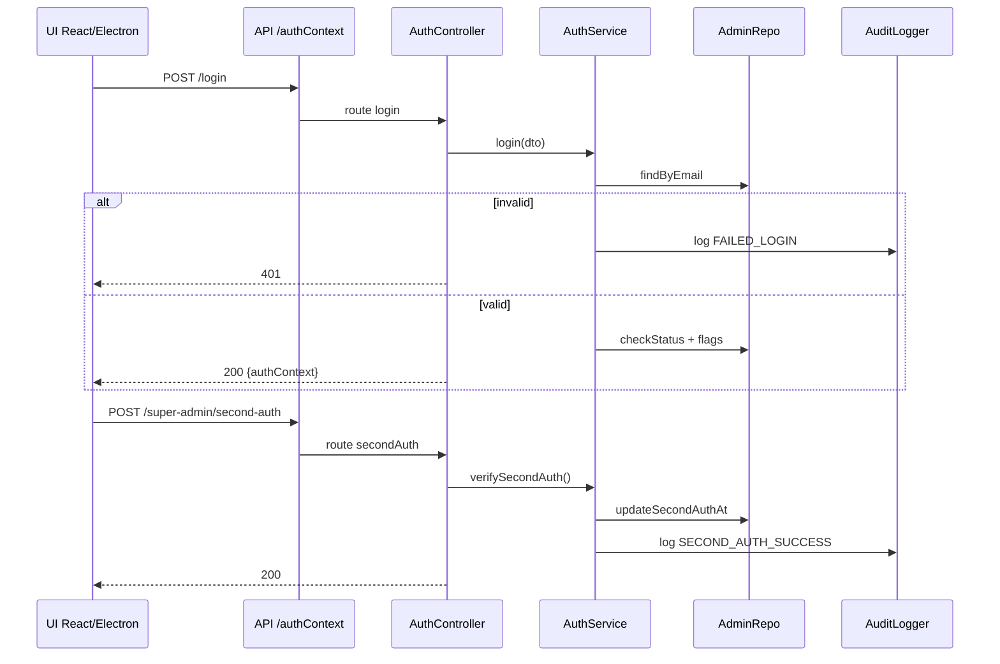

# Sequence (Conception) — Login + second auth

```mermaid
sequenceDiagram
  participant UI as UI React/Electron
  participant API as API /authContext
  participant CTRL as AuthController
  participant SVC as AuthService
  participant REPO as AdminRepo
  participant AUD as AuditLogger

  UI->>API: POST /login
  API->>CTRL: route login
  CTRL->>SVC: login(dto)
  SVC->>REPO: findByEmail
  alt invalid
    SVC->>AUD: log FAILED_LOGIN
    CTRL-->>UI: 401
  else valid
    SVC->>REPO: checkStatus + flags
    CTRL-->>UI: 200 {authContext}
  end

  UI->>API: POST /super-admin/second-auth
  API->>CTRL: route secondAuth
  CTRL->>SVC: verifySecondAuth()
  SVC->>REPO: updateSecondAuthAt
  SVC->>AUD: log SECOND_AUTH_SUCCESS
  CTRL-->>UI: 200
```
