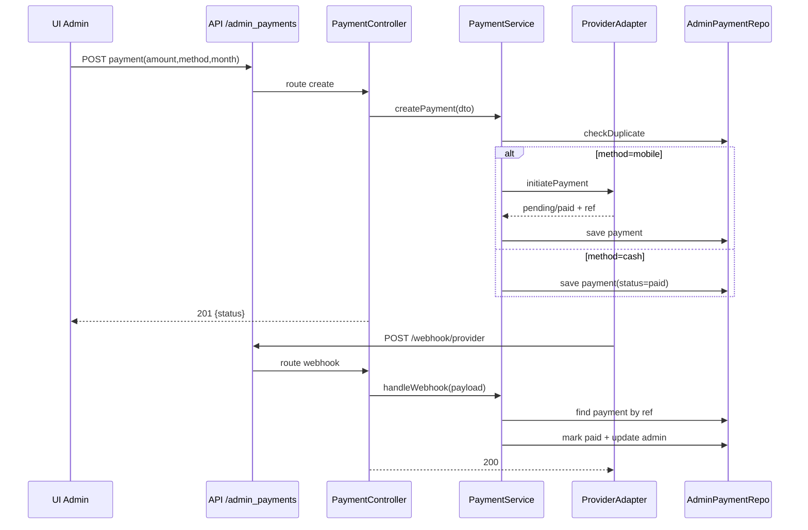

# Sequence (Conception) — Paiement admin + webhook

```mermaid
sequenceDiagram
  participant UI as UI Admin
  participant API as API /admin_payments
  participant CTRL as PaymentController
  participant SVC as PaymentService
  participant PSP as ProviderAdapter
  participant DB as AdminPaymentRepo

  UI->>API: POST payment(amount,method,month)
  API->>CTRL: route create
  CTRL->>SVC: createPayment(dto)
  SVC->>DB: checkDuplicate
  alt method=mobile
    SVC->>PSP: initiatePayment
    PSP-->>SVC: pending/paid + ref
    SVC->>DB: save payment
  else method=cash
    SVC->>DB: save payment(status=paid)
  end
  CTRL-->>UI: 201 {status}

  PSP->>API: POST /webhook/provider
  API->>CTRL: route webhook
  CTRL->>SVC: handleWebhook(payload)
  SVC->>DB: find payment by ref
  SVC->>DB: mark paid + update admin
  CTRL-->>PSP: 200
```
