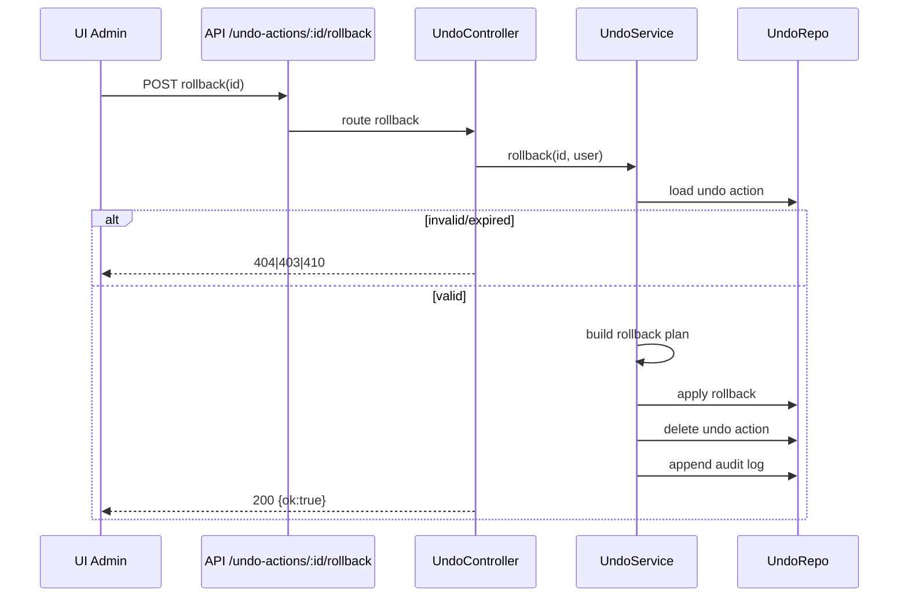

# Sequence (Conception) — Undo rollback

```mermaid
sequenceDiagram
  participant UI as UI Admin
  participant API as API /undo-actions/:id/rollback
  participant CTRL as UndoController
  participant SVC as UndoService
  participant DB as UndoRepo

  UI->>API: POST rollback(id)
  API->>CTRL: route rollback
  CTRL->>SVC: rollback(id, user)
  SVC->>DB: load undo action
  alt invalid/expired
    CTRL-->>UI: 404|403|410
  else valid
    SVC->>SVC: build rollback plan
    SVC->>DB: apply rollback
    SVC->>DB: delete undo action
    SVC->>DB: append audit log
    CTRL-->>UI: 200 {ok:true}
  end
```
