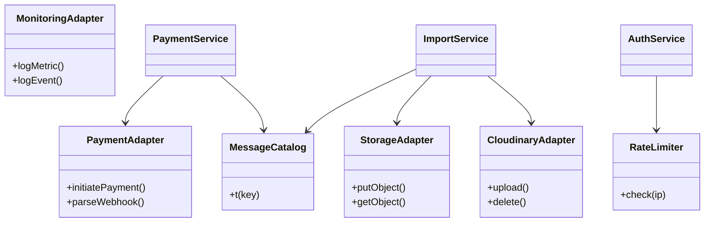

# Diagramme de classes — Adapters & integration

```mermaid
classDiagram
  class PaymentAdapter {
    +initiatePayment()
    +parseWebhook()
  }
  class CloudinaryAdapter {
    +upload()
    +delete()
  }
  class StorageAdapter {
    +putObject()
    +getObject()
  }
  class MonitoringAdapter {
    +logMetric()
    +logEvent()
  }
  class MessageCatalog {
    +t(key)
  }
  class RateLimiter {
    +check(ip)
  }

  PaymentService --> PaymentAdapter
  ImportService --> StorageAdapter
  ImportService --> CloudinaryAdapter
  AuthService --> RateLimiter
  PaymentService --> MessageCatalog
  ImportService --> MessageCatalog
```
