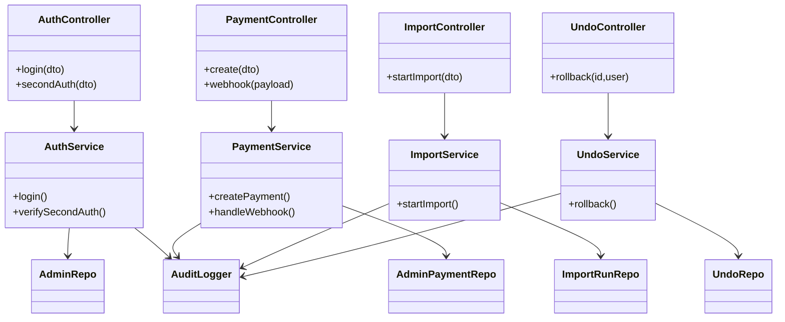

# Diagramme de classes — Vue technique

```mermaid
classDiagram
  class AuthController {
    +login(dto)
    +secondAuth(dto)
  }
  class PaymentController {
    +create(dto)
    +webhook(payload)
  }
  class ImportController {
    +startImport(dto)
  }
  class UndoController {
    +rollback(id,user)
  }

  class AuthService {
    +login()
    +verifySecondAuth()
  }
  class PaymentService {
    +createPayment()
    +handleWebhook()
  }
  class ImportService {
    +startImport()
  }
  class UndoService {
    +rollback()
  }

  class AdminRepo
  class AdminPaymentRepo
  class ImportRunRepo
  class UndoRepo
  class AuditLogger

  AuthController --> AuthService
  PaymentController --> PaymentService
  ImportController --> ImportService
  UndoController --> UndoService

  AuthService --> AdminRepo
  PaymentService --> AdminPaymentRepo
  ImportService --> ImportRunRepo
  UndoService --> UndoRepo
  AuthService --> AuditLogger
  PaymentService --> AuditLogger
  ImportService --> AuditLogger
  UndoService --> AuditLogger
```
