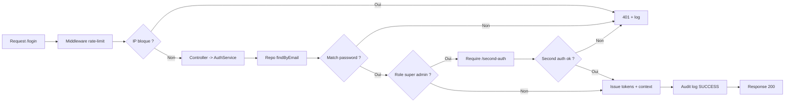

# Activite technique — Authentification admin

```mermaid
flowchart LR
  A[Request /login] --> B[Middleware rate-limit]
  B --> C{IP bloque ?}
  C -->|Oui| X[401 + log]
  C -->|Non| D[Controller -> AuthService]
  D --> E[Repo findByEmail]
  E --> F{Match password ?}
  F -->|Non| X
  F -->|Oui| G{Role super admin ?}
  G -->|Oui| H[Require /second-auth]
  G -->|Non| J[Issue tokens + context]
  H --> I{Second auth ok ?}
  I -->|Non| X
  I -->|Oui| J
  J --> K[Audit log SUCCESS]
  K --> L[Response 200]
```
