## Use cases par acteur

### Diagramme global (acteurs + UC)

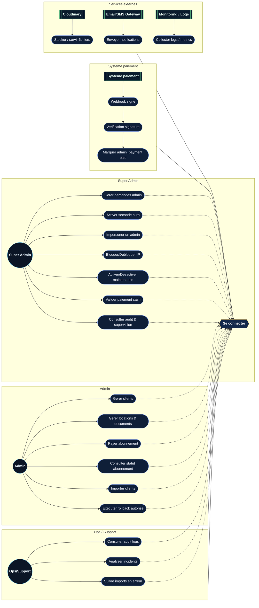

### SUPER_ADMIN

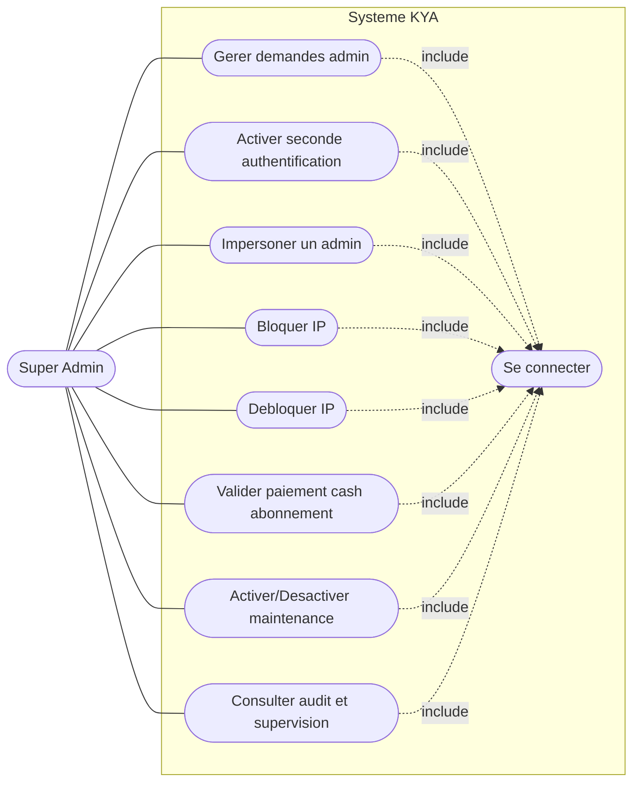

### ADMIN

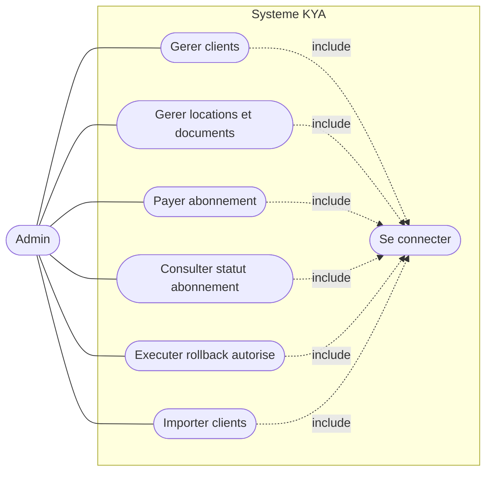

### OPS/SUPPORT

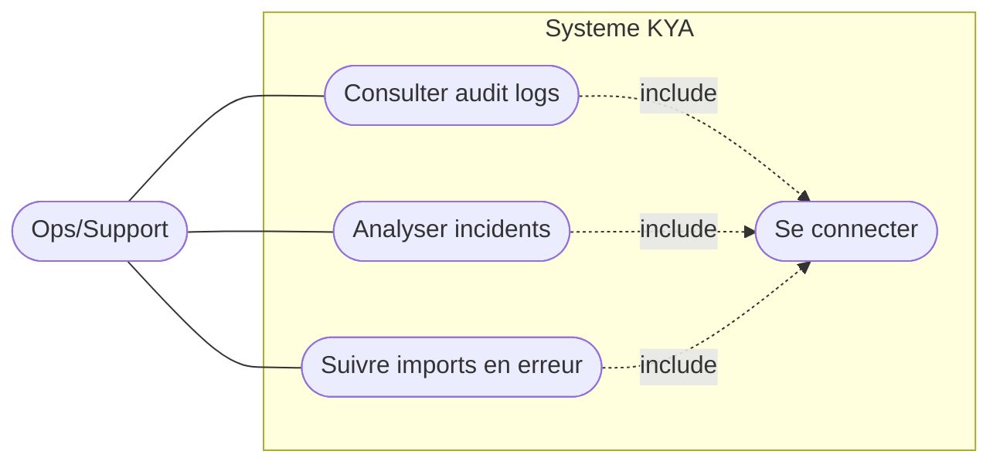

### SYSTEME PAIEMENT

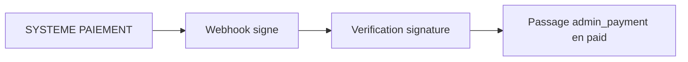

## Use cases par domaine (DDD / Hexagonal) - Diagrammes separes

### Domaine Identity / Auth

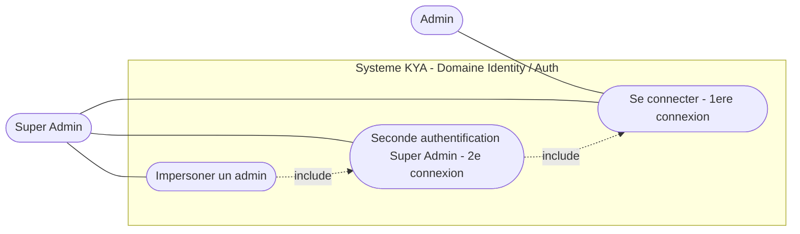

### Domaine Subscription / Abonnement

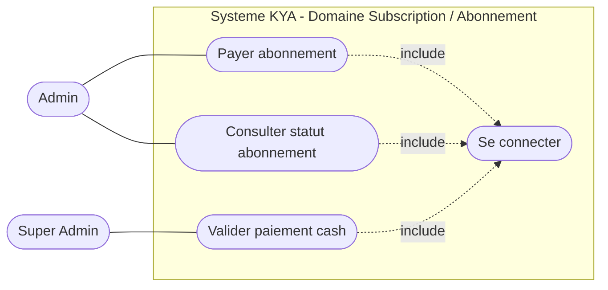

### Domaine Billing / Paiement

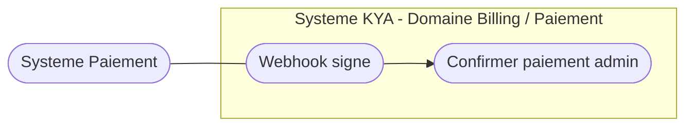

### Domaine Clients

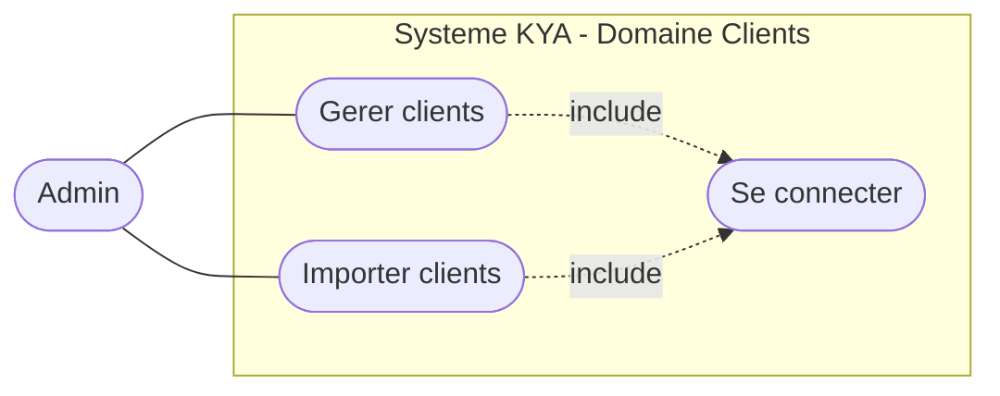

### Domaine Locations & Documents

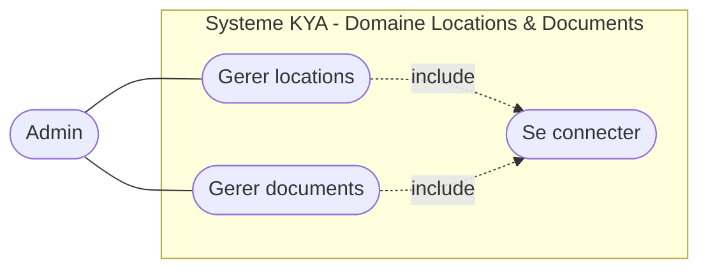

### Domaine Audit & Support

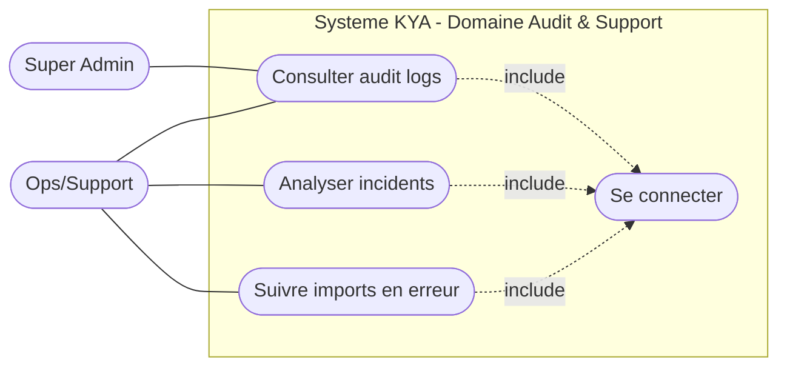

### Domaine Plateforme

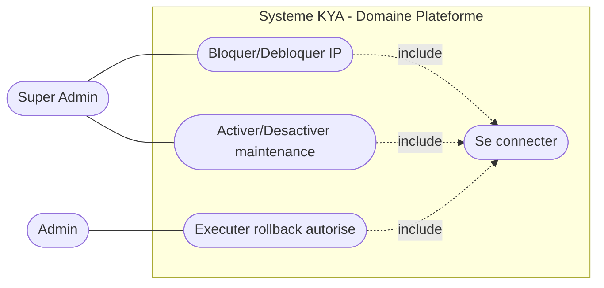

# Activite abonnement

# Aspect Fonctionnel - Analyse - Diagramme d Activite

## Activite transversale: abonnement admin

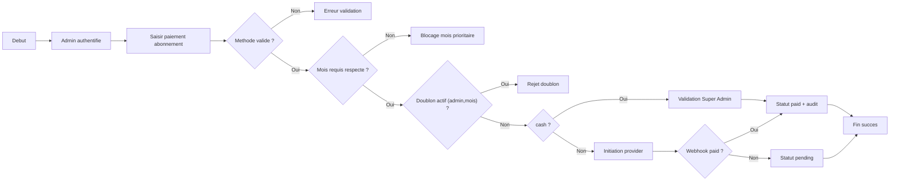

# Architecture globale

# Aspect Architectural - Diagramme d Architecture Globale

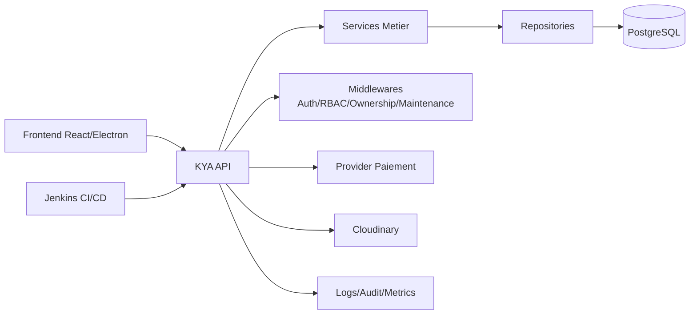

# Architecture frontend

# Aspect Architectural - Frontend React/Electron

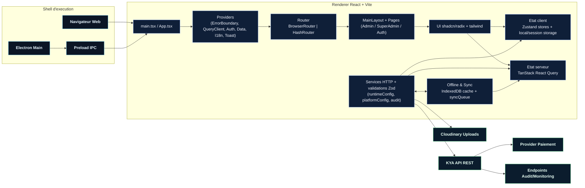

# Architecture backend

# Aspect Architectural - Backend Next.js / DDD

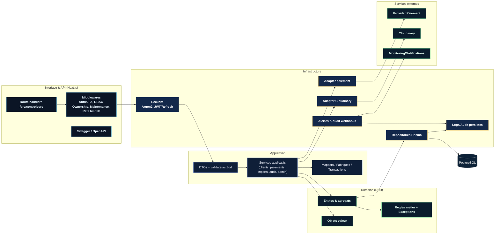

# Composants backend

# Aspect Architectural - Diagramme de Composants

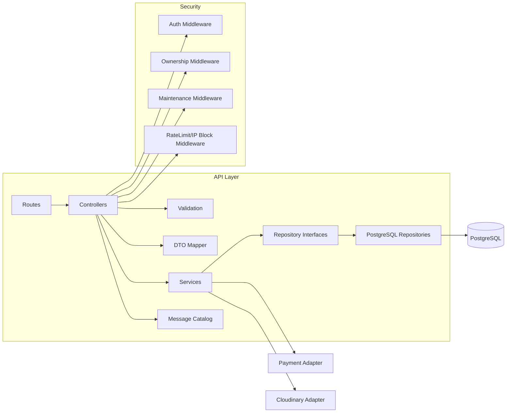

# Diagrammes de sequence

# Diagrammes de Sequence

## Login + second auth

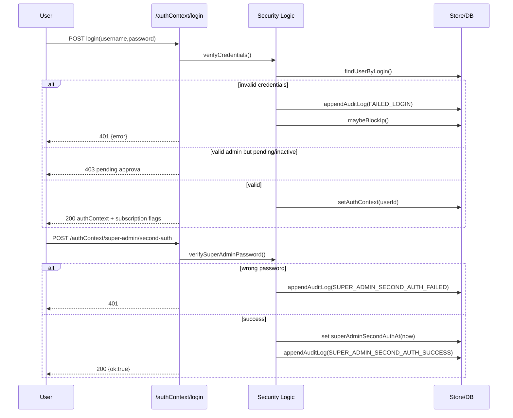

## Creation paiement admin + webhook

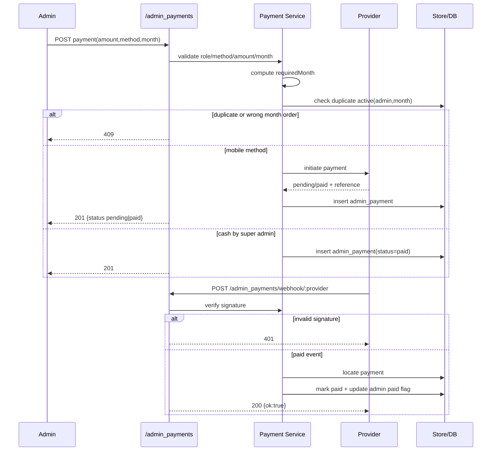

## Import clients + erreurs

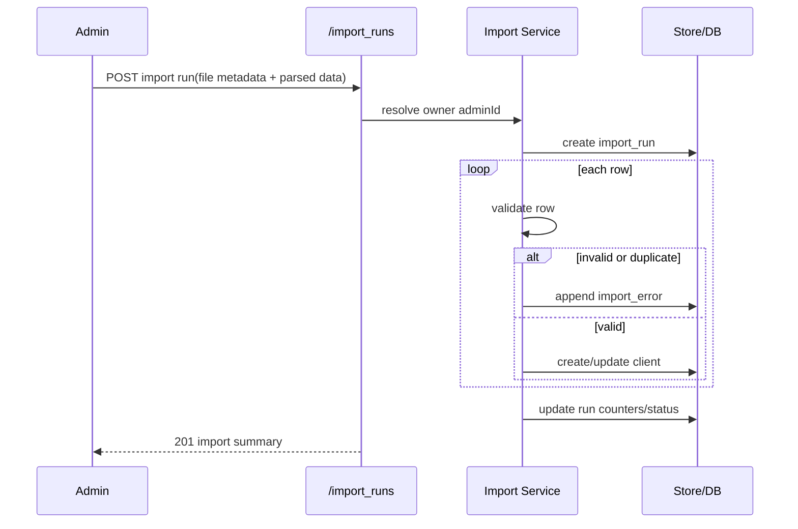

## Undo rollback

```mermaid
sequenceDiagram
  participant U as User
  participant API as /undo-actions/:id/rollback
  participant Undo as Undo Service
  participant DB as Store/DB

  U->>API: POST rollback(id)
  API->>Undo: verify auth + ownership
  Undo->>DB: load undo entry
  alt not found/forbidden/expired
    API-->>U: 404|403|410
  else valid
    Undo->>Undo: resolve rollback plan
    Undo->>DB: apply rollback + side effects
    Undo->>DB: remove undo entry
    Undo->>DB: append audit log
    API-->>U: 200 {ok:true}
  end
```

# Modelisation du cahier des charges

## Diagramme de contexte (systeme et acteurs)

```mermaid
flowchart LR
  AD([Admin])
  SA([Super Admin])
  OPS([Ops/Support])
  PSP([Systeme Paiement])
  CLD([Service Cloud])
  NOTIF([Service Notification])

  subgraph SYS["Systeme KYA"]
    CORE["Backend API + Frontend"]
  end

  AD --- CORE
  SA --- CORE
  OPS --- CORE
  PSP --- CORE
  CLD --- CORE
  NOTIF --- CORE
```

## Diagramme de classes (modele de domaine)

```mermaid
classDiagram
  class Utilisateur
  class Admin
  class Entreprise
  class Client
  class Location
  class Document
  class PaiementMensuel
  class TransactionPaiement
  class PaiementCaution
  class PaiementAbonnementAdmin
  class StatutAbonnementAdmin
  class ExecutionImport
  class ErreurImport
  class MessageErreurImport
  class Notification
  class JournalAudit
  class JournalAuditAdmin
  class IpBloquee
  class ParametreAdmin

  Utilisateur "1" --> "0..1" Admin : profilAdmin
  Admin "0..1" --> "0..1" Entreprise : entreprise
  Admin "1" --> "0..*" Client : gere
  Client "1" --> "0..*" Location : possede
  Location "1" --> "0..*" Document : documents
  Location "1" --> "0..*" PaiementMensuel : paiementsMensuels
  PaiementMensuel "1" --> "0..*" TransactionPaiement : transactions
  Location "1" --> "0..*" PaiementCaution : depots
  Admin "1" --> "0..*" PaiementAbonnementAdmin : abonnements
  Admin "1" --> "0..1" StatutAbonnementAdmin : statut
  Admin "0..1" --> "0..*" ExecutionImport : imports
  ExecutionImport "1" --> "0..*" ErreurImport : erreurs
  ErreurImport "1" --> "0..*" MessageErreurImport : messages
  Utilisateur "1" --> "0..*" Notification : notifications
  Utilisateur "0..1" --> "0..*" JournalAudit : auditsSecurite
```

## Diagrammes de classes par domaine (base sur use cases)

### Domaine Identity / Auth

```mermaid
classDiagram
  class Utilisateur
  class Admin
  class SessionAuthentification
  class JetonRefresh
  class TentativeConnexion
  class PermissionUtilisateur

  Utilisateur "1" --> "0..1" Admin : profilAdmin
  Utilisateur "1" --> "0..*" SessionAuthentification : sessions
  SessionAuthentification "1" --> "0..*" JetonRefresh : refreshTokens
  Utilisateur "1" --> "0..*" TentativeConnexion : tentatives
  Utilisateur "1" --> "0..*" PermissionUtilisateur : permissions
```

### Domaine Subscription / Abonnement

```mermaid
classDiagram
  class Admin
  class PaiementAbonnementAdmin
  class StatutAbonnementAdmin

  Admin "1" --> "0..*" PaiementAbonnementAdmin : paiements
  Admin "1" --> "0..1" StatutAbonnementAdmin : statut
```

### Domaine Billing / Paiement

```mermaid
classDiagram
  class Location
  class PaiementMensuel
  class TransactionPaiement
  class PaiementCaution

  Location "1" --> "0..*" PaiementMensuel : loyers
  PaiementMensuel "1" --> "0..*" TransactionPaiement : transactions
  Location "1" --> "0..*" PaiementCaution : depots
```

### Domaine Clients

```mermaid
classDiagram
  class Admin
  class Client
  class Entreprise

  Admin "1" --> "0..*" Client : gere
  Admin "0..1" --> "0..1" Entreprise : entreprise
```

### Domaine Locations & Documents

```mermaid
classDiagram
  class Client
  class Location
  class Document

  Client "1" --> "0..*" Location : locations
  Location "1" --> "0..*" Document : documents
```

### Domaine Audit & Support

```mermaid
classDiagram
  class JournalAudit
  class JournalAuditAdmin
  class ExecutionImport
  class ErreurImport
  class MessageErreurImport
  class Notification
  class ItemTravail

  ExecutionImport "1" --> "0..*" ErreurImport : erreurs
  ErreurImport "1" --> "0..*" MessageErreurImport : messages
```

### Domaine Plateforme

```mermaid
classDiagram
  class ConfigurationSysteme
  class ParametreAdmin
  class IpBloquee
  class IdempotenceMutation
```
