# Use case global

# Aspect Fonctionnel - Analyse - Diagramme de Cas d Utilisation

## Diagramme global

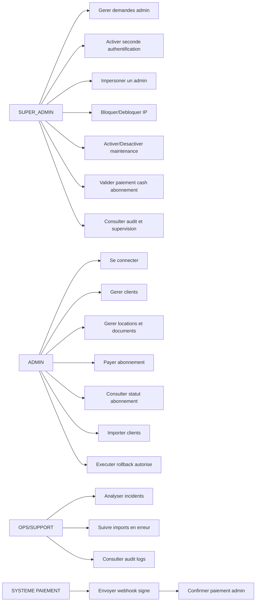

## Use cases par acteur

### SUPER_ADMIN

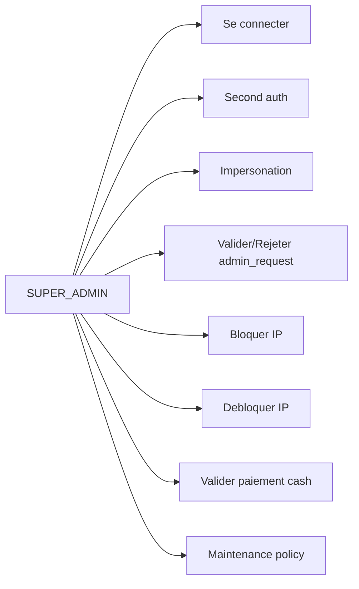

### ADMIN

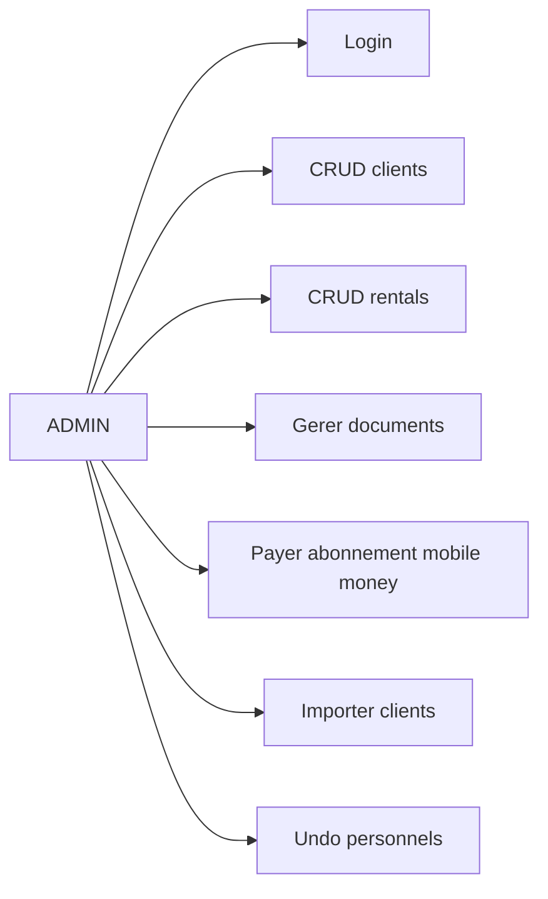

### OPS/SUPPORT

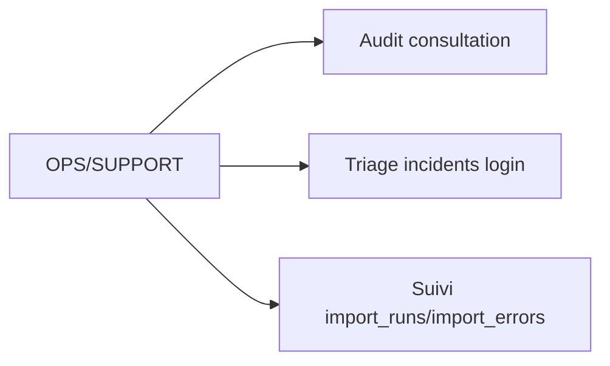

### SYSTEME PAIEMENT

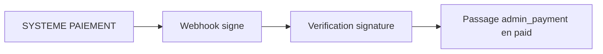

# Activite abonnement

# Aspect Fonctionnel - Analyse - Diagramme d Activite

## Activite transversale: abonnement admin

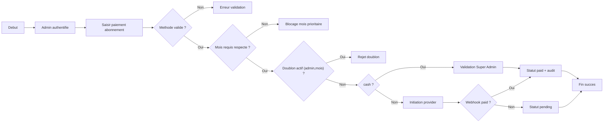

# Architecture globale

# Aspect Architectural - Diagramme d Architecture Globale

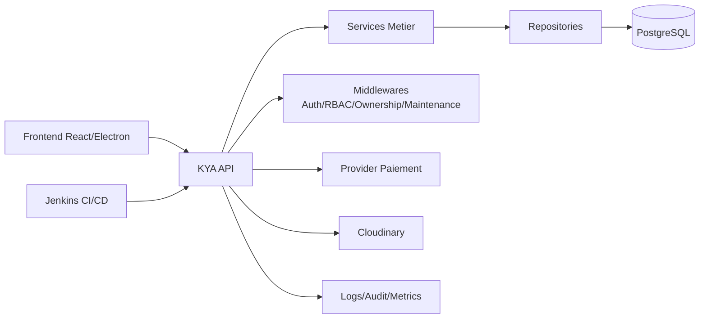

# Composants backend

# Aspect Architectural - Diagramme de Composants

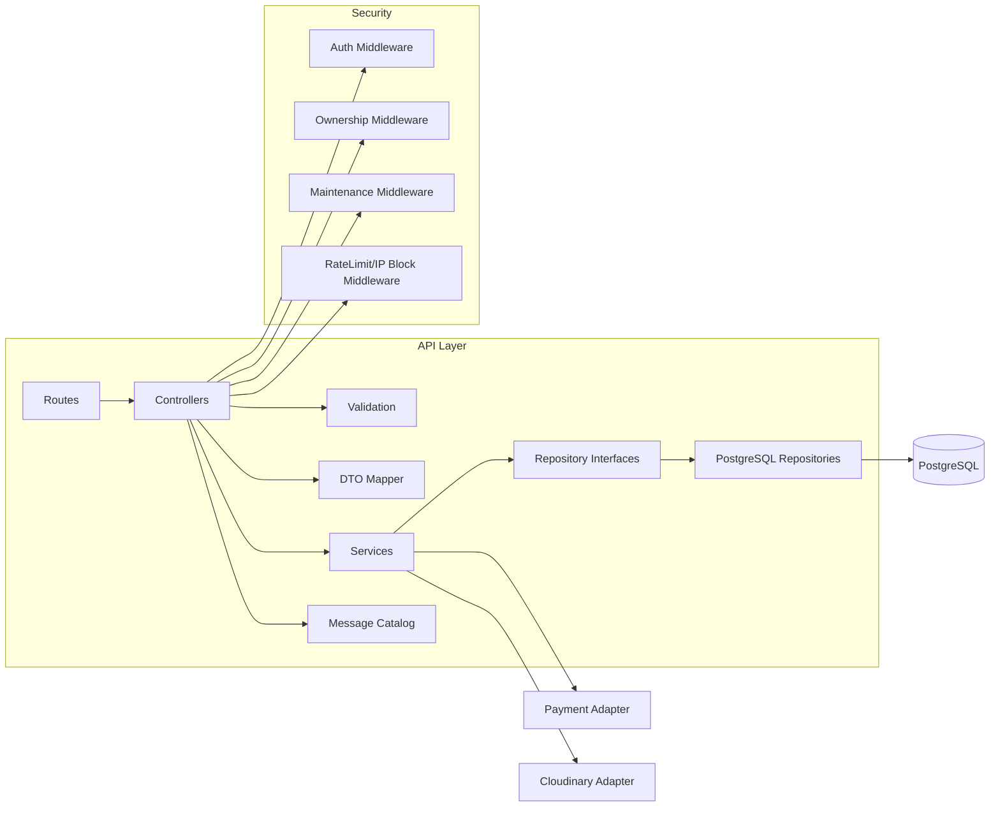

# Diagrammes de sequence

# Diagrammes de Sequence

## Login + second auth

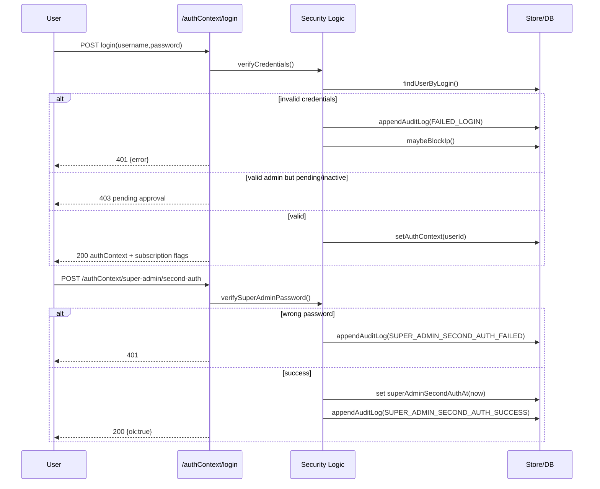

## Creation paiement admin + webhook

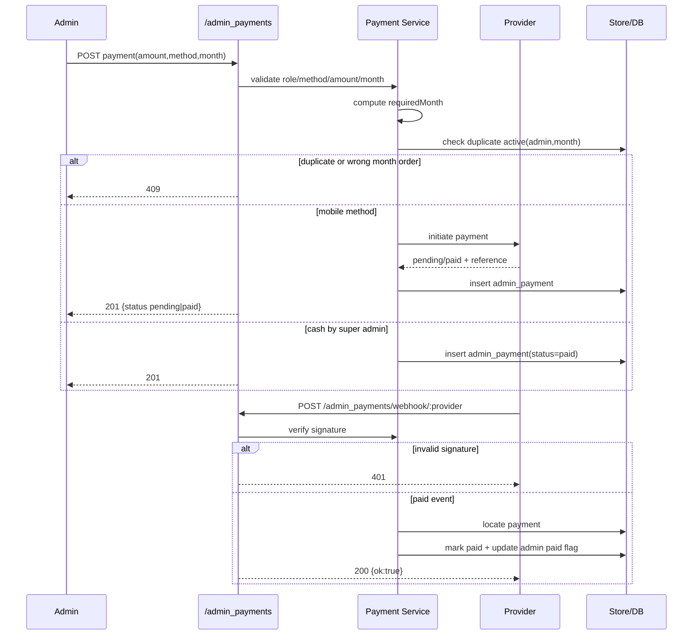

## Import clients + erreurs

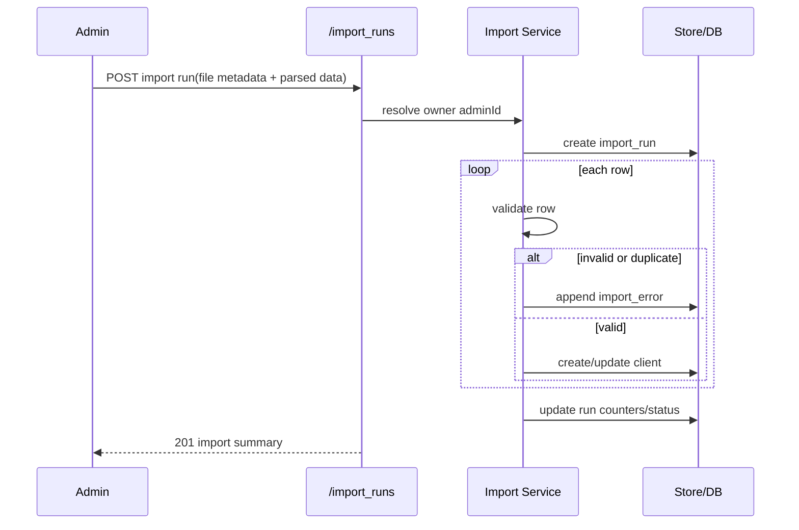

## Undo rollback

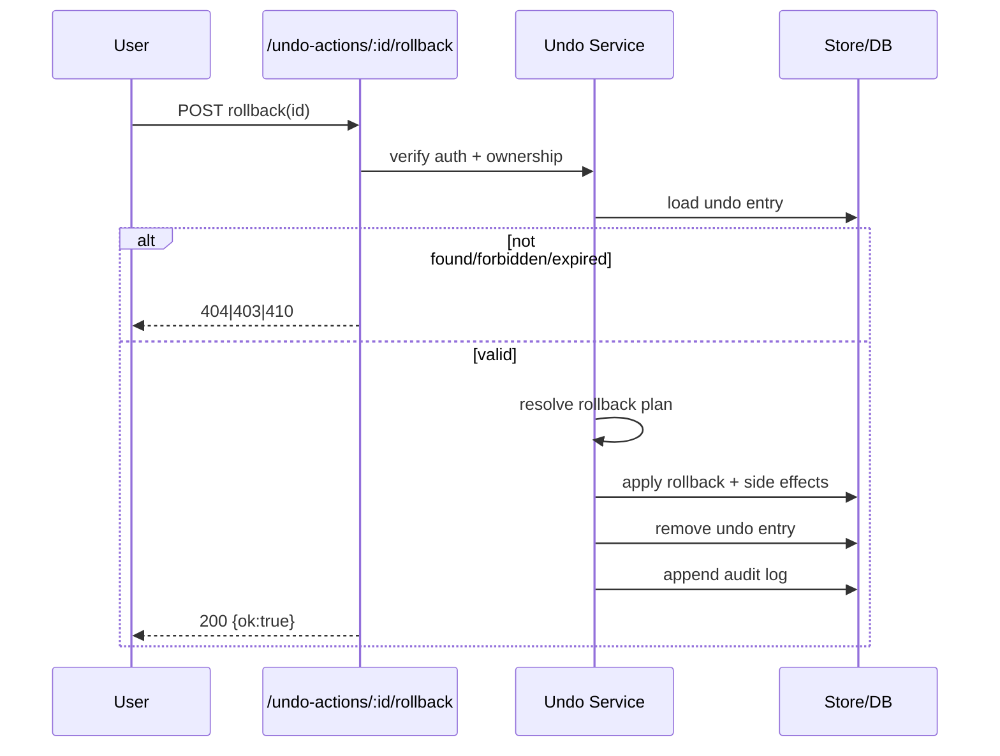
