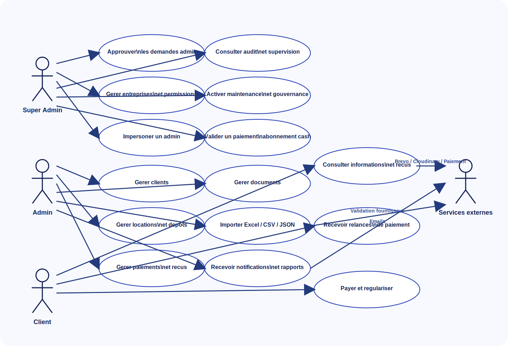
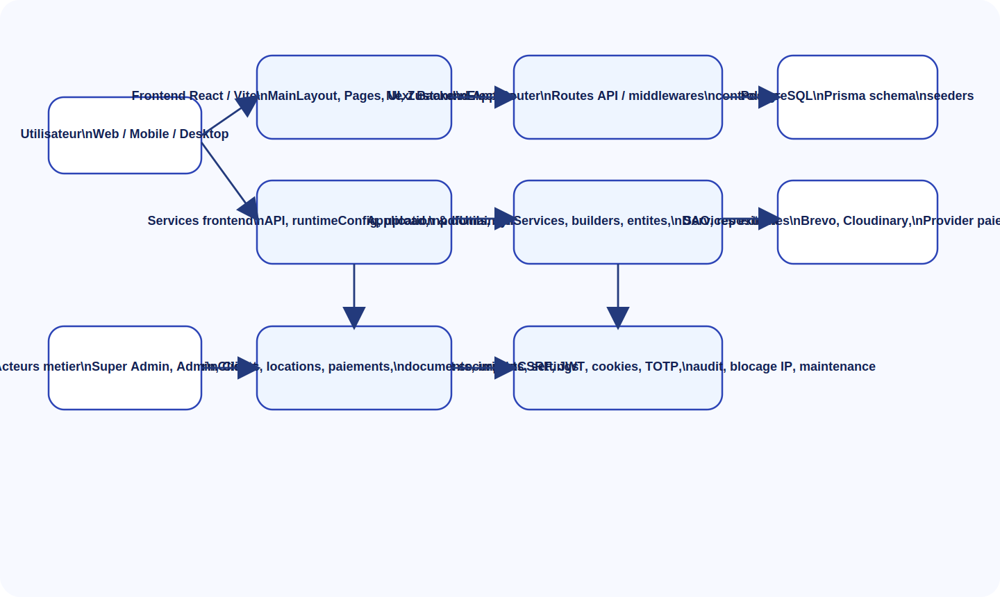
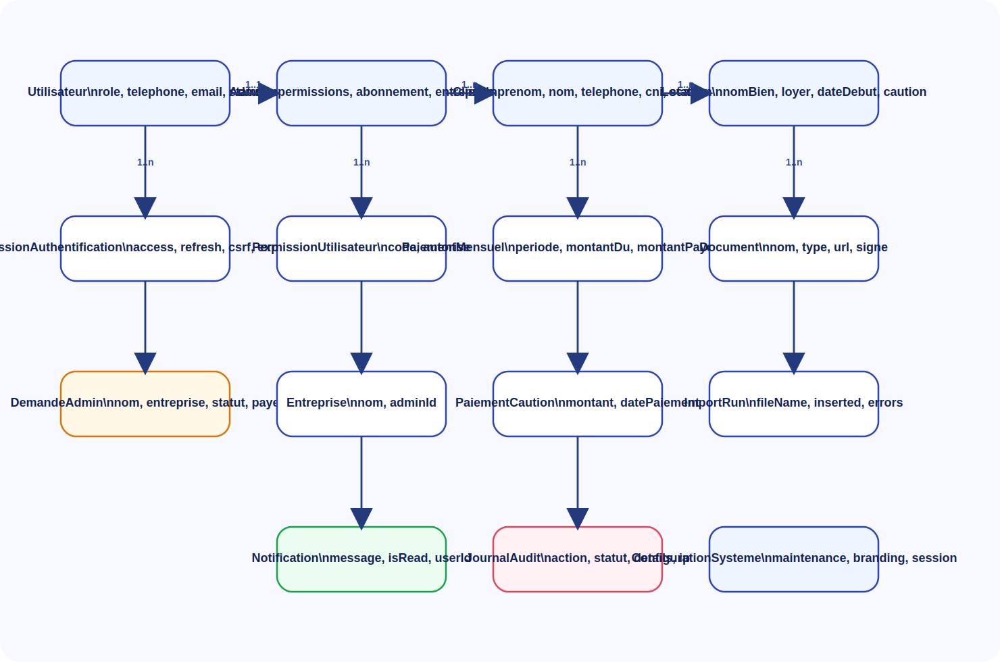

# Memoire de fin de cycle - KYA (Keur Ya Aicha)

Ce fichier est un squelette de memoire inspire de l'exemple `memoire Oumar SY.pdf` (71 pages).
Objectif: te donner une structure complete, et te guider sur quoi remplacer/ajouter pour ton projet KYA.

Notes:
- Reste coherent: meme vocabulaire (acteurs, roles, modules) du debut a la fin.
- Mets des captures/diagrammes uniquement quand ils servent une explication.
- Les diagrammes deja generes sont dans `mon_projet_soutenance/soutenance_pack_assets/`.
- Les sources Mermaid sont dans `mon_projet_soutenance/diagrammes_mermaid_kya.md`.

---

## Page de garde (a personnaliser)

- Etudiant: Papa Malick Teuw
- Formation: Developpeur Full Stack Web et Mobile
- Etablissement: Orange Digital Center (ODC)
- Annee academique: 2025-2026
- Encadrant academique: [Nom]
- Eventuel maitre de stage / tuteur entreprise: [Nom]
- Sujet: KYA (Keur Ya Aicha) - Plateforme de gestion locative multi-roles

---

## Dedicace (optionnel)

[Ton texte]

---

## Remerciements

[Ton texte]

---

## Abstract (EN) + Resume (FR)

### Abstract (EN)

- Context:
- Problem:
- Proposed solution (KYA):
- Main features:
- Tech stack:
- Results:

### Resume (FR)

- Contexte:
- Problematique:
- Solution proposee (KYA):
- Fonctionnalites clefs:
- Stack technique:
- Resultats:

---

## Glossaire (exemples a adapter)

- RBAC: Role-Based Access Control
- JWT: JSON Web Token
- CSRF: Cross-Site Request Forgery
- ORM: Object-Relational Mapping
- CI/CD: Continuous Integration / Continuous Deployment
- SaaS: Software as a Service
- ODC: Orange Digital Center

---

## Sommaire

(A generer plus tard, quand le plan est stable)

---

# INTRODUCTION

## Contexte et motivation

- Decrire le contexte de la gestion locative (agences, proprietaires, multi-acteurs).
- Expliquer les irritants (doublons, oublis, suivi paiement/caution, documents disperses).

## Problematique

- Formuler 1-2 questions centrales (ex: comment fiabiliser la gestion locative multi-roles et tracer les actions?).

## Objectifs

- Objectif principal:
- Objectifs secondaires:

## Demarche et organisation du memoire

- Decrire les grandes parties (I..V) et ce qu'on y trouve.

---

# I. Presentation de l'organisme d'accueil (ou du cadre du projet)

Choisis une variante:
- Variante A (stage): decrire l'entreprise d'accueil + equipe + environnement.
- Variante B (projet academique): decrire ODC / cadre pedagogique + equipe projet + roles.

## I.1. Presentation

- Historique / mission / activites.
- Positionnement (si applicable).

## I.2. Equipe et cadre de travail

- Roles (chef de projet, dev, test, etc).
- Outils de collaboration (Git, board, communication).

---

# II. Presentation du sujet et des objectifs (KYA)

## 1. Presentation du sujet

KYA (Keur Ya Aicha) est une plateforme de gestion locative multi-roles qui vise a:
- Centraliser clients, locations, paiements, cautions et documents.
- Differencier Super Admin, Admin, Client (et eventuel OPS/Support).
- Supporter l'import de donnees (Excel/CSV/JSON) avec controle anti-doublon.
- Fournir un produit deployable sur web, avec declinaison desktop (Electron) si necessaire.

## 2. Contexte

- Processus actuel (manuel / Excel / WhatsApp / papier).
- Contraintes et attentes (traçabilite, audit, separation des donnees par admin).

## 3. Problematique de l'existant (points de douleur)

- Doublons et incoherences.
- Manque d'historique et d'audit.
- Documents non relies aux dossiers.
- Paiements/abonnements difficiles a suivre.

## 4. Objectifs

- Reduire les erreurs de gestion.
- Ameliorer la visibilite (dashboard, historique, audit).
- Renforcer la securite (RBAC, isolation, protections).
- Faciliter l'import et la correction avant insertion.

## 5. Perimetre fonctionnel (roles et modules)

- Super Admin: approbation admin, gouvernance, maintenance, impersonation, supervision, blocage IP.
- Admin: gestion clients/locations/paiements/documents, import, abonnement.
- Client: consultation de ses infos/recus/relances (selon choix produit).
- Services externes: paiement, Cloudinary, Brevo (notifications).

Diagrammes utiles:
- Use case global: `mon_projet_soutenance/soutenance_pack_assets/use_case_global.svg`
- Use case import: `mon_projet_soutenance/soutenance_pack_assets/use_case_import.svg`

## 6. Outils et stack technique

### 6.1 Outils

- Git / GitHub (ou autre), board de suivi, IDE, Postman/Insomnia.
- Outils de diagrammes: Mermaid / Figma.

### 6.2 Frontend

- React + Vite + TypeScript
- Gestion d'etat (ex: Zustand)
- Routing (React Router)

### 6.3 Backend

- Next.js (App Router) pour l'API
- Prisma + PostgreSQL
- Authentification (JWT/cookies) + RBAC

### 6.4 Deploiement et services externes

- Frontend: Vercel
- Backend: Render (ou autre)
- Cloudinary (medias/documents)
- Brevo (email/notifications)
- Provider paiement (webhooks signes)

Architecture utile:
- Globale: `mon_projet_soutenance/soutenance_pack_assets/architecture_globale.svg`
- Frontend: `mon_projet_soutenance/soutenance_pack_assets/architecture_frontend.svg`
- Backend: `mon_projet_soutenance/soutenance_pack_assets/architecture_backend.svg`
- Deploiement: `mon_projet_soutenance/soutenance_pack_assets/architecture_deploiement.svg`

---

# III. Methodologie

## 1. Choix methodologique (classique vs agile)

Option (court): expliquer pourquoi une approche iterative est adaptee (besoins evolutifs, feedback).
Option (long): faire une comparaison rapide (cascade / V vs Scrum/XP) comme dans l'exemple.

## 2. Organisation du travail

- Backlog / epics / user stories.
- Sprints (duree, rituels).
- Definition of Done (tests, lint, review).

## 3. Qualite et securite

- Regles de nommage / conventions.
- Tests (unitaires/integration si existants).
- Lint / format.
- Journalisation et audit.

---

# IV. Conception detaillee

## IV.1 Diagrammes de cas d'utilisation

Acteurs proposes (a valider):
- Super Admin
- Admin
- Client
- OPS/Support (optionnel)
- Systeme de paiement (externe)

Inclure:
- Diagramme global (deja ci-dessus).
- Un use-case par "grande fonctionnalite" (import, approbation admin, paiement abonnement, etc).

## IV.2 Modele de donnees / diagramme de classes

- Entites principales: Utilisateur, Admin, Client, Location, Paiement, Document.
- Entites techniques: ImportRun, Notification, JournalAudit.

Diagrammes utiles:
- Modele de donnees: `mon_projet_soutenance/soutenance_pack_assets/modele_donnees.svg`
- Diagramme classes technique: `mon_projet_soutenance/soutenance_pack_assets/diagramme_classes_technique.svg`

## IV.3 Diagrammes de sequence (par scenario)

Scenarios typiques:
- Authentification / login
- Approbation d'un admin par le Super Admin
- Import clients
- Paiement abonnement + webhook

Diagrammes utiles:
- `mon_projet_soutenance/soutenance_pack_assets/sequence_login_auth.svg`
- `mon_projet_soutenance/soutenance_pack_assets/sequence_approbation_admin.svg`
- `mon_projet_soutenance/soutenance_pack_assets/sequence_import_clients.svg`
- `mon_projet_soutenance/soutenance_pack_assets/sequence_paiement_abonnement.svg`

## IV.4 Prototypage UI (Figma) (optionnel mais recommande)

- Captures / maquettes des ecrans clefs.
- Regles UX (validation formulaires, erreurs, etats vides).

---

# V. Developpement de l'application

## V.1 Organisation du code (front + back)

- Decoupage en couches (routes/controllers/services/repositories).
- DTO/validation.
- Gestion des erreurs et codes HTTP.

## V.2 Gestion de projet (outil)

- Si tu utilises Trello / GitHub Projects / Notion: expliquer l'outil et comment tu suis les taches.
- Joindre 1 capture si utile.

## V.3 Automatisation (CI/CD) et deploiement

- Pipeline (lint/build/tests si existants).
- Deploiement Vercel/Render.
- Gestion des variables d'environnement et secrets.
- Webhooks paiement signes.

## V.4 Presentation de l'application (fonctionnalites)

Structure recommande:
- Authentification et gestion des roles
- Approbation admin (Super Admin)
- Import clients (previsualisation, mapping, anti-doublon, journal)
- Gestion locations/paiements/documents
- Audit et supervision

Inclure des captures d'ecran (ou liens) uniquement sur les ecrans clefs.

Liens (a mettre a jour si besoin):
- Frontend: https://keur-ya-aicha-frontend.vercel.app
- Backend API: https://bakend-next-saas-gestion-client.onrender.com/api
- Docs backend: https://bakend-next-saas-gestion-client.onrender.com/docs

---

# CONCLUSION GENERALE

- Bilan par rapport aux objectifs.
- Limites (techniques et fonctionnelles).
- Perspectives (ex: roles plus fins, multi-tenant avance, reporting, mobile, etc).

---

# WEBOGRAPHIE / REFERENCES

- Documentation Next.js
- Documentation React / Vite
- Documentation Prisma / PostgreSQL
- Docs Cloudinary / Brevo / provider paiement
- Articles de securite web (CSRF, cookies, JWT)

---

## Annexes (optionnel)

- Extraits de code (uniquement les plus pertinents).
- Captures CI/CD.
- Exemples de fichiers d'import (CSV/Excel) anonymises.

